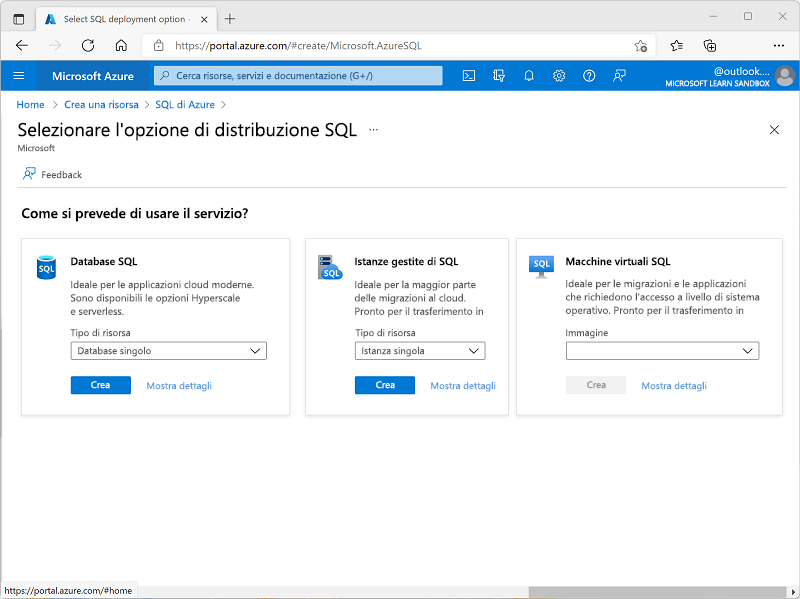
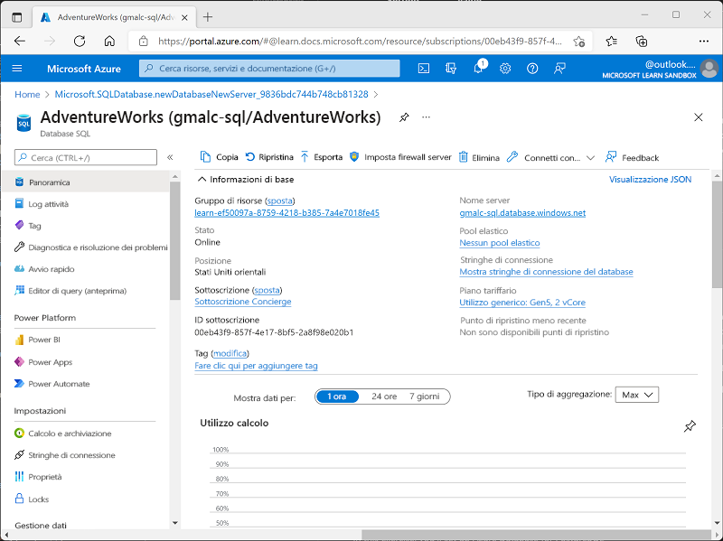
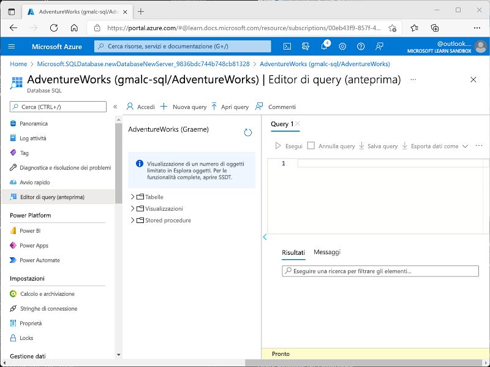
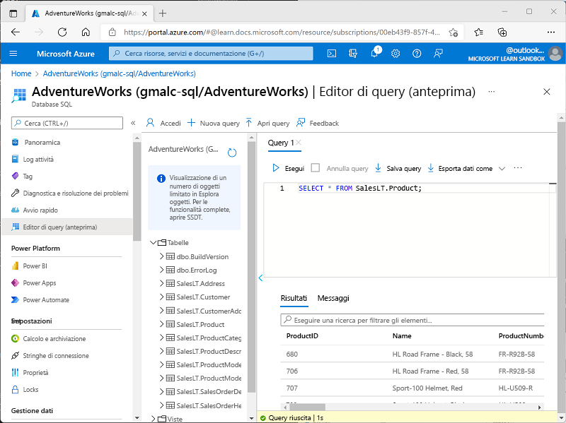

---
lab:
  title: Esplorare il database SQL di Azure
  module: Explore relational data in Azure
---

# <a name="explore-azure-sql-database"></a>Esplorare il database SQL di Azure

In questo esercizio si effettuerà il provisioning di una risorsa del database SQL di Azure nella sottoscrizione di Azure e si userà quindi SQL per eseguire una query delle tabelle nel database relazionale.

Il completamento di questo lab richiederà circa **15** minuti.

## <a name="before-you-start"></a>Prima di iniziare

Sarà necessaria una [sottoscrizione di Azure](https://azure.microsoft.com/free) con accesso di livello amministrativo.

## <a name="provision-an-azure-sql-database-resource"></a>Effettuare il provisioning di una risorsa del database SQL di Azure

1. Nel [portale di Azure](https://portal.azure.com?azure-portal=true) selezionare **&#65291; Crea una risorsa** nell'angolo in alto a sinistra e cercare *Azure SQL*. Nella pagina **Azure SQL** risultante selezionare **Crea**.

1. Esaminare le opzioni di Azure SQL disponibili e quindi nel riquadro **SQL database** verificare che sia selezionato **Database singolo** e selezionare **Crea**.

    

1. Immettere i valori seguenti nella pagina **Crea database SQL**:
    - **Sottoscrizione** Selezionare la sottoscrizione di Azure.
    - **Gruppo di risorse**: creare un nuovo gruppo di risorse con un nome di propria scelta.
    - **Nome database**: *AdventureWorks*
    -                 **Server**: selezionare **Crea nuovo** e creare un nuovo server con un nome univoco in qualsiasi posizione disponibile. Usare **Autenticazione SQL** e specificare il proprio nome come account di accesso amministratore server e una password adeguatamente complessa (da ricordare perché sarà necessaria più avanti).
    - **Usare il pool elastico SQL?**: *No*
    - **Calcolo e archiviazione**: lasciare invariati
    - **Ridondanza dell'archivio di backup**: selezionare *Archivio di backup con ridondanza locale*

1. Nella pagina **Crea database SQL** selezionare **Avanti: Rete >** e quindi nella pagina **Rete**, nella sezione **Connettività di rete**, selezionare **Endpoint pubblico**. Selezionare quindi **Sì** per entrambe le opzioni nella sezione **Regole del firewall** per consentire l'accesso al server di database dai servizi di Azure e dall'indirizzo IP client corrente.

1. Selezionare **Avanti: Sicurezza >** e impostare l'opzione **Abilita Microsoft Defender for SQL** su **Non ora**.

1. Selezionare **Avanti: Impostazioni aggiuntive>** e nella scheda **Impostazioni aggiuntive** impostare l'opzione **Usa dati esistenti** su **Esempio** per creare un database di esempio che sarà possibile esplorare in un secondo momento.

1. Selezionare **Rivedi e crea** e quindi selezionare **Crea** per creare il database SQL di Azure.

1. Attendere il completamento della distribuzione. Passare quindi alla risorsa distribuita, che dovrebbe essere simile alla seguente:

    

1. Nel riquadro a sinistra della pagina selezionare **Editor di query (anteprima)** e accedere usando l'account di accesso amministratore e la password specificati per il server.
    
    *Se viene visualizzato un messaggio di errore che informa che l'indirizzo IP client non è consentito, selezionare il collegamento **IP elenco elementi consentiti…** alla fine del messaggio per consentire l'accesso e provare nuovamente ad accedere (in precedenza è stato aggiunto l'indirizzo IP client del computer alle regole del firewall, ma l'editor di query può connettersi da un indirizzo diverso a seconda della configurazione di rete).*
    
    L'editor di query ha un aspetto simile al seguente:
    
    

1. Espandere la cartella **Tabelle** per visualizzare le tabelle nel database.

1. Nel riquadro **Query 1** immettere il codice SQL seguente:

    ```sql
    SELECT * FROM SalesLT.Product;
    ```

1. Selezionare **&#9655; Esegui** sopra la query per eseguirla e visualizzare i risultati, che dovrebbero includere tutte le colonne per tutte le righe nella tabella **SalesLT.Product**, come mostrato qui:

    

1. Sostituire l'istruzione SELECT con il codice seguente e quindi selezionare **&#9655; Esegui** per eseguire la nuova query ed esaminare i risultati (che includono solo le colonne **ProductID**, **Name**, **ListPrice** e **ProductCategoryID**):

    ```sql
    SELECT ProductID, Name, ListPrice, ProductCategoryID
    FROM SalesLT.Product;
    ```

1. Ora provare la query seguente, che usa un JOIN per ottenere il nome della categoria dalla tabella **SalesLT.ProductCategory**:

    ```sql
    SELECT p.ProductID, p.Name AS ProductName,
            c.Name AS Category, p.ListPrice
    FROM SalesLT.Product AS p
    JOIN [SalesLT].[ProductCategory] AS c
        ON p.ProductCategoryID = c.ProductCategoryID;
    ```

1. Chiudere il riquadro dell'editor di query, rimuovendo le modifiche.

> **Suggerimento**: se è stata completata l'esplorazione di Database SQL di Azure, è possibile eliminare il gruppo di risorse creato in questo esercizio.
