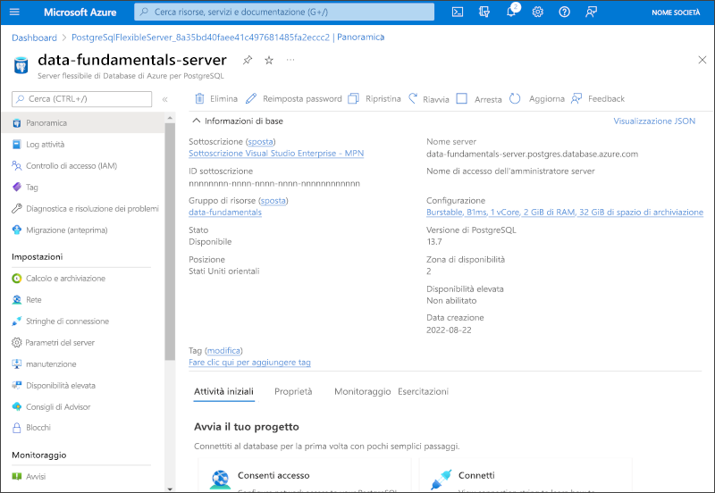

---
lab:
  title: Esplorare Database di Azure per PostgreSQL
  module: Explore relational data in Azure
---

# Esplorare Database di Azure per PostgreSQL

In questo esercizio si effettuerà il provisioning di una risorsa di Database di Azure per PostgreSQL nella sottoscrizione personale di Azure.

Il completamento di questo lab richiederà circa **5** minuti.

## Prima di iniziare

Sarà necessaria una [sottoscrizione di Azure](https://azure.microsoft.com/free) con accesso di livello amministrativo.

## Effettuare il provisioning di una risorsa di Database di Azure per PostgreSQL

In questo esercizio si effettuerà il provisioning di una risorsa di Database di Azure per PostgreSQL.

1. In the Azure portal, select <bpt id="p1">**</bpt>&amp;#65291; Create a resource<ept id="p1">**</ept> from the upper left-hand corner and search for <bpt id="p2">*</bpt>Azure Database for PostgreSQL<ept id="p2">*</ept>. Then in the resulting <bpt id="p1">**</bpt>Azure Database for PostgreSQL<ept id="p1">**</ept> page, select <bpt id="p2">**</bpt>Create<ept id="p2">**</ept>.

1. Esaminare le opzioni di Database di Azure per PostgreSQL disponibili e quindi nel riquadro **Server flessibile** selezionare **Crea**.

    

1. Immettere i valori seguenti nella pagina **Crea database SQL**:
    - **Sottoscrizione** Selezionare la sottoscrizione di Azure.
    - **Gruppo di risorse**: creare un nuovo gruppo di risorse con un nome di propria scelta.
    - **Nome server**: Immettere un nome univoco.
    - **Area**: selezionare un'area nelle vicinanze.
    - **Versione di PostgreSQL**: lasciare invariata.
    - **Tipo di carico di lavoro**: selezionare **Sviluppo**.
    - **Calcolo e archiviazione**: lasciare invariati.
    - **Zona di disponibilità**: lasciare invariata.
    - **Abilita disponibilità elevata**: lasciare invariata.
    - **Nome utente amministratore**: il proprio nome.
    - **Password** e **Conferma password**: una password adeguatamente complessa.

1. Al termine, selezionare **Avanti: Rete**.

1. In **Regole del firewall** selezionare **&#65291; Aggiungere l'indirizzo IP client corrente**.

1. Selezionare **Rivedi e crea** e quindi selezionare **Crea** per creare il database PostgreSQL di Azure.

1. Wait for deployment to complete. Then go to the resource that was deployed, which should look like this:

    

1. Esaminare le opzioni per la gestione della risorsa di Database di Azure per PostgreSQL.

> **Suggerimento**: se è stata completata l'esplorazione di Database di Azure per PostgreSQL, è possibile eliminare il gruppo di risorse creato in questo esercizio.
