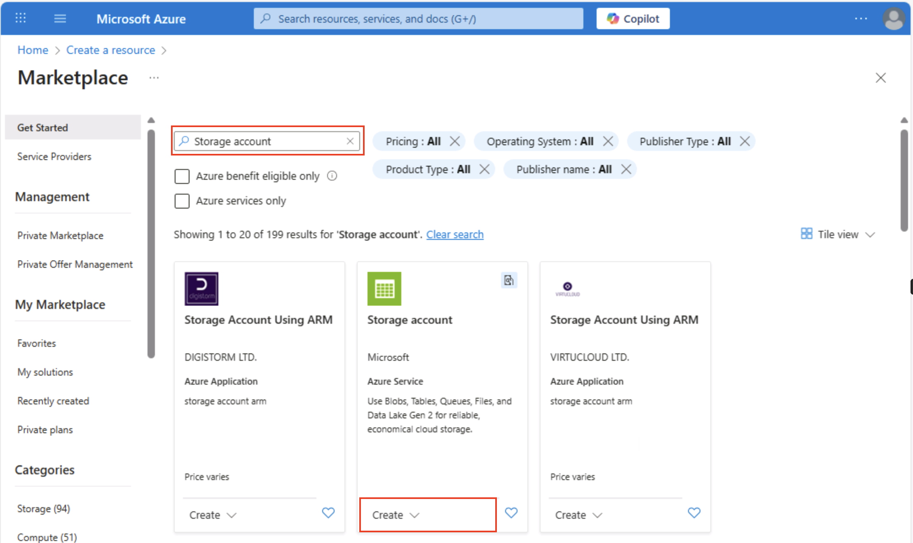

---
lab:
  title: Esplorare Archiviazione di Azure
  module: Explore Azure Storage for non-relational data
---

# Esplorare Archiviazione di Azure

In questo esercizio si apprenderà come effettuare il provisioning e configurare un account Archiviazione di Azure ed esplorare i servizi principali: Archiviazione BLOB, Data Lake Storage Gen2, File di Azure e Tabelle di Azure. Si otterrà un'esperienza pratica con la creazione di contenitori, il caricamento di dati, l'abilitazione di spazi dei nomi gerarchici, la configurazione di condivisioni file e la gestione delle entità di tabella. Queste competenze consentono di comprendere come archiviare, organizzare e proteggere i dati non relazionali in Azure per diversi scenari di analisi e applicazioni.

Il completamento di questo lab richiederà circa **15** minuti.

> _**Suggerimento**: comprendere lo scopo di ogni azione consente di progettare in un secondo momento soluzioni di archiviazione che bilanciano i costi, le prestazioni, la sicurezza e gli obiettivi di analisi. Queste brevi note perché legano ogni passaggio a una ragione reale._

## Prima di iniziare

Sarà necessaria una [sottoscrizione di Azure](https://azure.microsoft.com/free) con accesso di livello amministrativo.

## Effettuare il provisioning di un account di archiviazione di Azure

Il primo passaggio per usare Archiviazione di Azure prevede il provisioning di un account di archiviazione di Azure nella sottoscrizione di Azure.

> _**Suggerimento**: un account di archiviazione è il limite sicuro e fatturabile per tutti i servizi Archiviazione di Azure (BLOB, file, code, tabelle). I criteri, la ridondanza, la crittografia, la rete e il controllo di accesso si applicano da qui verso il basso._

1. Accedere al [portale di Azure](https://portal.azure.com?azure-portal=true) se questa operazione non è già stata eseguita.

1. Nella home page portale di Azure selezionare **&#65291; Creare una risorsa** dall'angolo superiore sinistro e cercare `Storage account`. Nella pagina **Account di archiviazione** risultante selezionare **Crea**.

    

1. Immettere i valori seguenti nella pagina **Crea un account di archiviazione**:
   
    - **Sottoscrizione**: selezionare una sottoscrizione di Azure.
    - **Gruppo di risorse**: creare un nuovo gruppo di risorse con un nome di propria scelta.
    - **Nome account di archiviazione**: immettere un nome univoco per l'account di archiviazione usando lettere minuscole e numeri.
    - **Area**: selezionare qualsiasi posizione disponibile.
    - **Prestazioni**: *Standard*
    - **Ridondanza**: *archiviazione con ridondanza locale*

    

    > _**Suggerimento**: un nuovo gruppo di risorse semplifica la pulizia. Standard + Archiviazione con ridondanza locale è la baseline di costo più basso, utile per l'apprendimento. L'archiviazione con ridondanza locale mantiene tre copie sincrone in un'area, adeguate per i dati demo non critici senza pagare per la replica geografica._

1. Selezionare **Avanti: Avanzate >** e visualizzare le opzioni di configurazione avanzate. In particolare, si noti che qui è possibile abilitare lo spazio dei nomi gerarchico per supportare Azure Data Lake Storage Gen2. Lasciare deselezionata questa opzione **<u>(verrà abilitata in un secondo momento) e quindi selezionare **Avanti: Rete >** per visualizzare le opzioni di rete per l'account di archiviazione.</u>**
   
   

1. Selezionare **Avanti: Protezione dei dati >** e quindi nella sezione **Recupero** <u>de</u>selezionare tutte le opzioni di **Abilita eliminazione temporanea**. Queste opzioni conservano i file eliminati per il recupero successivo, ma possono causare problemi in un secondo momento quando si abilita lo spazio dei nomi gerarchico.

    

1. Continuare a fare clic su **Avanti >** nelle pagine rimanenti senza modificare nessuna delle impostazioni predefinite e quindi nella pagina **Rivedi** attendere la convalida delle selezioni e selezionare **Crea** per creare l'account di archiviazione di Azure.

1. Attendere il completamento della distribuzione. Passare quindi alla risorsa distribuita.

## Esplorare l'archivio BLOB

Dopo aver creato un account di archiviazione di Azure, è possibile creare un contenitore per i dati BLOB.

> _**Suggerimento**: un contenitore raggruppa BLOB e rappresenta il primo livello di ambito per il controllo di accesso. A partire dall'archiviazione BLOB normale (nessuno spazio dei nomi gerarchico) mostra il comportamento della cartella virtuale che verrà confrontato con Data Lake Gen2 in un secondo momento._

1. Scaricare il file JSON [product1.json](https://aka.ms/product1.json?azure-portal=true) da `https://aka.ms/product1.json` e salvarlo nel computer. È possibile salvarlo in qualsiasi cartella per caricarlo nell'archivio BLOB in seguito.

    *Se il file JSON viene visualizzato nel browser, fare clic con il pulsante destro del mouse sulla pagina e scegliere **Salva con nome**. Denominare il file  **product1.json** e archiviarlo nella cartella dei download.* 

2. Nella pagina del portale di Azure del contenitore di archiviazione, sulla sinistra, nella sezione **Archiviazione dati** selezionare **Contenitori**.
   
    

3. **Nella pagina Contenitori** selezionare **&#65291; Aggiungere un contenitore e aggiungere un nuovo contenitore** denominato `data` con un livello di **accesso anonimo privato (nessun accesso anonimo).**

    

    > _**Suggerimento**: private mantiene protetti i dati di esempio. L'accesso pubblico è raramente necessario, ad eccezione di siti Web statici o scenari di dati aperti. La denominazione `data` mantiene questo esempio semplice e leggibile._

4. Una volta creato il contenitore **data**, verificare che sia elencato nella pagina **Contenitori**.

5. Nel riquadro a sinistra, nella sezione in alto selezionare **Browser archiviazione**. Questa pagina fornisce un'interfaccia basata su browser che consente di lavorare con i dati nell'account di archiviazione.

6. Nella pagina del browser archiviazione selezionare **Contenitori BLOB** e verificare che il contenitore **data** sia elencato.

7. Selezionare il contenitore **data** e notare che è vuoto.

    

8. Seleziona **&#65291; Aggiungere Directory** e leggere le informazioni sulle cartelle prima di creare una nuova directory denominata `products`.

9. Nel browser archiviazione verificare che la visualizzazione corrente mostri il contenuto della cartella **products** appena creata. Si noti che il percorso di navigazione nella parte superiore della pagina corrisponde al percorso **Contenitori BLOB > data > products**.

    

10. Nel percorso di navigazione selezionare **data** per passare al contenitore **data** e si noti che <u>non</u> contiene una cartella denominata **products**.

    Le cartelle nell'archivio BLOB sono virtuali ed esistono solo come parte del percorso di un BLOB. Poiché la cartella **products** non contiene BLOB, non esiste realmente.

    > _**Suggerimento**: lo spazio dei nomi flat indica che le directory sono solo prefissi dei nomi (prodotti/file.json). Questa progettazione consente una scalabilità massiva perché il servizio indicizza i nomi dei BLOB invece di mantenere una struttura ad albero vera._

11. Usare il pulsante **&#10514; Carica** per aprire il pannello **Carica BLOB**.

12. Nel pannello **Carica BLOB** selezionare il file **product1.json** salvato in precedenza nel computer locale. Quindi, nella **sezione Avanzate** , nella casella Carica nella **cartella** immettere `product_data` e selezionare il **pulsante Carica** .

    

    > _**Suggerimento**: specificare un nome di cartella durante il caricamento automatico crea automaticamente il percorso virtuale, illustrando che la presenza di un BLOB rende visualizzata la "cartella"._

13. Chiudere il pannello **Caricare BLOB** se è ancora aperto e verificare che una cartella virtuale **product_data** sia stata creata nel contenitore **data**.

14. Selezionare la cartella **product_data** e verificare che contenga il BLOB **product1.json** caricato.

15. Sulla sinistra, nella sezione **Archiviazione dati** selezionare **Contenitori**.

16. Aprire il contenitore **data** e verificare che sia elencata la cartella **product_data** creata.

17. Selezionare il **&#x2027; &#x2027; &#x2027;** icona all'estremità destra della cartella e si noti che il menu non visualizza alcuna opzione. Le cartelle in un contenitore BLOB dello spazio dei nomi flat sono virtuali e non possono essere gestite.

    

    > _**Suggerimento**: non esiste alcun oggetto directory reale, quindi non sono presenti operazioni di ridenominazione/autorizzazione, che richiedono uno spazio dei nomi gerarchico._

18. Usare l'icona **X** in alto a destra nella pagina **data** per chiudere la pagina e tornare alla pagina **Contenitori**.

## Esplorare Azure Data Lake Storage Gen2

Il supporto di Azure Data Lake Store Gen2 consente di usare cartelle gerarchiche per organizzare e gestire l'accesso ai BLOB. Consente anche di usare l'archivio BLOB di Azure per ospitare file system distribuiti per piattaforme di analisi dei Big Data comuni.

> _**Suggerimento**: l'attivazione dello spazio dei nomi gerarchico rende le cartelle simili alle directory reali. Consente anche di eseguire azioni di cartella in modo sicuro (tutte contemporaneamente, senza errori) e offre controlli di autorizzazione file simili a quelli in Linux. Ciò è particolarmente utile quando si lavora con strumenti di Big Data come Spark o Hadoop o quando si gestiscono data lake di grandi dimensioni organizzati._

1. Scaricare il [file JSON product2.json](https://aka.ms/product2.json?azure-portal=true) da `https://aka.ms/product2.json` e salvarlo nel computer nella stessa cartella in cui è stato scaricato **product1.json** in precedenza. Il file verrà caricato nell'archivio BLOB in un secondo momento.

1. Nella pagina del portale di Azure dell'account di archiviazione, sulla sinistra scorrere verso il basso fino alla sezione **Impostazioni** e selezionare **Aggiornamento di Data Lake Gen2**.

    

1. **Nella pagina di aggiornamento** di Data Lake Gen2 espandere e completare ogni passaggio per aggiornare l'account di archiviazione per abilitare lo spazio dei nomi gerarchico e supportare Azure Data Lake Storage Gen. Questa operazione potrebbe richiedere tempo.

    

    > _**Suggerimento**: l'aggiornamento è un cambio di funzionalità a livello di account: i dati rimangono, ma la semantica della directory cambia per supportare le operazioni avanzate._

1. Al termine dell'aggiornamento, nel riquadro a sinistra, nella sezione in alto selezionare **Browser archiviazione** e tornare alla radice del contenitore BLOB **data**, che contiene ancora la cartella **product_data**.

1. Selezionare la cartella **product_data** e verificare che contenga ancora il file **product1.json** caricato in precedenza.

1. Usare il pulsante **&#10514; Carica** per aprire il pannello **Carica BLOB**.

1. Nel pannello **Carica BLOB** selezionare il file **product2.json** salvato nel computer locale. Selezionare quindi il pulsante **Carica**.

1. Chiudere il pannello **Carica BLOB** se è ancora aperto e verificare che una cartella **product_data** contenga ora il file **product2.json**.

    

    > _**Suggerimento**: l'aggiunta di un secondo file dopo l'aggiornamento conferma la continuità senza problemi: i BLOB esistenti continuano a funzionare e quelli nuovi ottengono vantaggi gerarchici, ad esempio elenchi di controllo di accesso alla directory (Controllo di accesso elenchi)._

1. Sulla sinistra, nella sezione **Archiviazione dati** selezionare **Contenitori**.

1. Aprire il contenitore **data** e verificare che sia elencata la cartella **product_data** creata.

1. Selezionare l'icona **&#x2027;&#x2027;&#x2027;** a destra della cartella e notare che, con lo spazio dei nomi gerarchico abilitato, è possibile eseguire attività di configurazione a livello di cartella, incluse la ridenominazione delle cartelle e l'impostazione delle autorizzazioni.

    

    > _**Suggerimento**: le cartelle reali consentono di applicare la sicurezza con privilegi minimi alla granularità delle cartelle, rinominare in modo sicuro e velocizzare le liste ricorsive rispetto all'analisi di migliaia di nomi BLOB con prefisso._

1. Usare l'icona **X** in alto a destra nella pagina **data** per chiudere la pagina e tornare alla pagina **Contenitori**.

## Esplorare File di Azure

File di Azure consente di creare condivisioni file basate sul cloud.

> _**Suggerimento**: File di Azure offre endpoint SMB/NFS per scenari lift-and-shift in cui le app prevedono un file system tradizionale. Integra (non sostituisce) l'archiviazione BLOB supportando i blocchi di file e gli strumenti nativi del sistema operativo._

1. Nella pagina del portale di Azure del contenitore di archiviazione, sulla sinistra, nella sezione **Archiviazione dati** selezionare **Condivisioni file**.

    

1. Nella pagina Condivisioni file selezionare **&#65291; ** Condivisione file e aggiungere una nuova condivisione file denominata `files` usando il livello Ottimizzato per le **transazioni** .

1. Selezionare **Avanti: Backup >** e disabilitare il backup. Selezionare quindi **Rivedi e crea**.

    

    > _**Suggerimento**: la disabilitazione del backup mantiene i costi inattivi per un ambiente lab di breve durata, che è possibile abilitare per la resilienza di produzione._

1. In **Condivisioni file** aprire la nuova condivisione **files**.

1. Nella parte superiore della pagina selezionare **Connetti**, quindi nel riquadro **Connetti** si noti che esistono schede per i sistemi operativi comuni (Windows, Linux e macOS) contenenti script che è possibile eseguire per connettersi alla cartella condivisa da un computer client.

    

    > _**Suggerimento**: gli script generati mostrano esattamente come montare la condivisione usando comandi nativi della piattaforma, illustrando i modelli di accesso ibrido da macchine virtuali, contenitori o server locali._

1. Chiudere il riquadro **Connetti** e quindi chiudere la pagina **files** per tornare alla pagina **Condivisioni file** dell'account di archiviazione di Azure.

## Esplorare le tabelle di Azure

Tabelle di Azure fornisce un archivio di coppie chiave/valore per le applicazioni che, pur dovendo archiviare i valori dei dati, non necessitano della funzionalità completa e della struttura di un database relazionale.

> _**Suggerimento**: l'archiviazione tabelle esegue query e join avanzati per costi ultra bassi, flessibilità senza schema e scalabilità orizzontale, ideale per log, dati IoT o profili utente._

1. Nella pagina del portale di Azure del contenitore di archiviazione, sulla sinistra, nella sezione **Archiviazione dati** selezionare **Tabelle**.

    

1. **Nella pagina Tabelle** selezionare **&#65291; Tabella** e creare una nuova tabella denominata `products`.

1. Una volta creata la tabella **products**, nel riquadro sulla sinistra, nella sezione in alto selezionare **Browser archiviazione**.

1. Nello strumento di esplorazione dell'archiviazione selezionare **Tabelle** e verificare che la tabella **products** sia elencata.

1. Selezionare la tabella **products**.

1. Nella pagina **product** selezionare **&#65291; Aggiungi entità**.

1. Nel pannello **Aggiungi entità** immettere i valori delle chiavi seguenti:
    - **PartitionKey**: 1
    - **RowKey**: 1

    > _**Suggerimento**: PartitionKey raggruppa le entità correlate per distribuire il carico; RowKey identifica in modo univoco all'interno della partizione. Insieme formano una chiave primaria composta veloce per le ricerche._

1. Selezionare **Aggiungi proprietà** e creare due nuove proprietà con i valori seguenti:

    |Nome proprietà | Type | valore |
    | ------------ | ---- | ----- |
    | Nome | string | Widget |
    | Price | Double | 2.99 |

    

1. Selezionare **Inserisci** per inserire una riga per la nuova entità nella tabella.

1. Nel browser archiviazione verificare che una riga sia stata aggiunta alla tabella **products** e che sia stata creata una colonna **Timestamp** per indicare quando la riga è stata modificata per l'ultima volta.

1. Aggiungere un'altra entità alla tabella **products** con le proprietà seguenti:

    |Nome proprietà | Type | Valore |
    | ------------ | ---- | ----- |
    | PartitionKey | String | 1 |
    | RowKey | String | 2 |
    | Nome | string | Kniknak |
    | Price | Double | 1,99 |
    | Sospeso | Booleano | true |

    > _**Suggerimento**: l'aggiunta di una seconda entità con chiavi diverse e una proprietà booleana aggiuntiva dimostra la flessibilità di scrittura dello schema. I nuovi attributi non richiedono una migrazione._

1. Dopo aver inserito la nuova entità, verificare che nella tabella sia visualizzata una riga contenente il prodotto fuori produzione.

    Sono stati immessi manualmente dati nella tabella usando l'interfaccia del browser archiviazione. In uno scenario reale, gli sviluppatori di applicazioni possono usare l'API Tabella di Archiviazione di Azure per creare applicazioni che leggono e scrivono valori nelle tabelle, il che ne fa una soluzione conveniente e scalabile per l'archiviazione NoSQL.

> _**Suggerimento**: se è stata completata l'esplorazione di Archiviazione di Azure, è possibile eliminare il gruppo di risorse creato in questo esercizio. L'eliminazione del gruppo di risorse è il modo più rapido per evitare addebiti continui rimuovendo ogni risorsa creata in un'unica azione._
