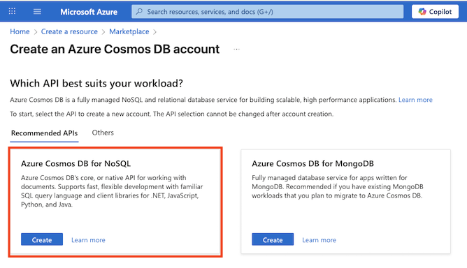
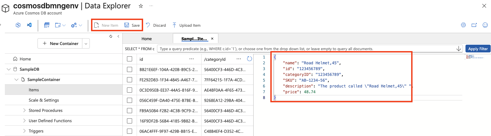

---
lab:
  title: Esplorare Azure Cosmos DB
  module: Explore fundamentals of Azure Cosmos DB
---
# Esplorare Azure Cosmos DB

Completando questo lab si apprenderà come effettuare il provisioning di un account Azure Cosmos DB, creare un database e un contenitore di esempio, aggiungere e visualizzare elementi JSON ed eseguire query simili a SQL per recuperare i dati. Si otterrà un'esperienza pratica con il portale di Azure e si comprenderà come Cosmos DB supporta l'archiviazione e l'esecuzione di query su dati flessibili e non relazionali.

Il completamento di questo lab richiederà circa **15** minuti.

## Prima di iniziare

Sarà necessaria una [sottoscrizione di Azure](https://azure.microsoft.com/free) con accesso di livello amministrativo.

## Creare un account Cosmos DB

Per usare Cosmos DB, è necessario effettuare il provisioning di un account Cosmos DB in una sottoscrizione di Azure. In questo esercizio si effettuerà il provisioning di un account Cosmos DB che usa Azure Cosmos DB for NoSQL.

1. Nella portale di Azure selezionare **+ Crea una risorsa** in alto a sinistra e cercare `Azure Cosmos DB`.  Nei risultati selezionare **Azure Cosmos DB** e quindi **Crea**.

    

1. Nel riquadro **Azure Cosmos DB for NoSQL** selezionare **Crea**.

    
   
    > _**Suggerimento**: l'account è il livello principale per le risorse di Cosmos DB. La scelta di Azure Cosmos DB per NoSQL consente di archiviare ed eseguire query sui dati JSON con un linguaggio di query semplice e simile a SQL._

1. Immettere i dettagli seguenti e quindi selezionare **Rivedi e crea**:
   
    - **Tipo di carico di** lavoro: Apprendimento
    - **Sottoscrizione**: se si sta usando una sandbox, selezionare *Concierge Subscription* (Sottoscrizione Concierge). In caso contrario, selezionare la sottoscrizione di Azure personale.
    - **Gruppo di risorse**: se si sta usando una sandbox, selezionare il gruppo di risorse esistente (che avrà un nome simile a *learn-xxxx...*). In caso contrario, creare un nuovo gruppo di risorse con il nome desiderato.
    - **Nome account**: immettere un nome univoco
    - **** zone di disponibilità: Disabilita
    - **Località**: scegliere una località consigliata
    - **Modalità di capacità**: velocità effettiva con provisioning
    - **Applica sconto livello gratuito**: selezionare Applica, se disponibile
    - **È possibile limitare la velocità effettiva totale dell'account**: opzione deselezionata
  
    > _**Perché queste scelte?**_
    >
    > _Il tipo di carico di** lavoro viene impostato **su Learning perché include impostazioni predefinite per principianti che semplificano la configurazione e mantengono bassi i costi. Il **nome** dell'account deve essere univoco nell'intero servizio, perché diventa parte dell'URL del servizio. È in corso la selezione di una **località** vicina, in modo che i test vengano eseguiti più velocemente. Le posizioni visualizzate dipendono dalla sottoscrizione e dal fatto che determinate zone di disponibilità siano abilitate. Per **la modalità** di capacità, la velocità effettiva con provisioning verrà eseguita in modo che le prestazioni rimangano prevedibili durante questo breve lab, anche se Serverless può essere corretto solo se è necessario occasionalmente. Se il **livello** gratuito è disponibile, verrà usato in modo da poter sperimentare senza accumulare addebiti. Infine, l'impostazione "**Limita la velocità effettiva** totale dell'account" è disattivata in modo che non venga rallentato in modo imprevisto mentre si lavora._

1. Una volta convalidata la configurazione, selezionare **Crea**.

    > _**Suggerimento**: il portale di Azure stima il tempo necessario per effettuare il provisioning di questa istanza di CosmosDB. Il tempo di creazione stimato viene calcolato in base alla posizione selezionata._

1. Attendere il completamento della distribuzione. Passare quindi alla risorsa distribuita.

## Creare un database di esempio

*Per tutta la durata di questa procedura, chiudere eventuali suggerimenti visualizzati nel portale*.

1. Nella pagina del nuovo account Cosmos DB, nel riquadro a sinistra selezionare **Esplora dati**.

    

1. Nella pagina **Esplora dati** selezionare **Avviare l'avvio rapido**.

    > _**Suggerimento**: Avvio rapido crea un database, un contenitore e dati di esempio funzionanti in modo da poter aggiungere ed eseguire query sugli elementi senza progettare prima uno schema._

1. Nella scheda **Nuovo contenitore** esaminare le impostazioni pre-popolate per il database di esempio e quindi selezionare **OK**.

1. Osservare lo stato nel pannello disponibile nella parte inferiore della schermata fino a quando non saranno stati creati il database **SampleDB** e il contenitore **SampleContainer** (questa operazione può richiedere alcuni minuti).

## Visualizzare e creare elementi

1. Nella pagina Esplora dati espandere il database **SampleDB** e il contenitore **SampleContainer** e selezionare **Elementi** per visualizzare l'elenco degli elementi disponibili nel contenitore. Gli elementi rappresentano dati di prodotto, ognuno con un ID univoco e altre proprietà.

    

1. Selezionare uno degli elementi nell'elenco per visualizzare una rappresentazione JSON dei rispettivi dati.

1. Nella parte superiore della pagina selezionare **Nuovo elemento** per creare un nuovo elemento vuoto.

1. Modificare il file JSON relativo al nuovo elemento come indicato di seguito e quindi selezionare **Salva**.

    ```json
   {
       "name": "Road Helmet,45",
       "id": "123456789",
       "categoryID": "123456789",
       "SKU": "AB-1234-56",
       "description": "The product called \"Road Helmet,45\" ",
       "price": 48.74
   }
    ```

    

1. Dopo aver salvato il nuovo elemento, osservare come siano state automaticamente aggiunte altre proprietà dei metadati.

    > _**Suggerimento**: Cosmos DB archivia gli elementi come JSON (JavaScript Object Notation), in modo da poter aggiungere campi adatti allo scenario senza uno schema rigido. Deve `id` essere univoco all'interno del contenitore. Dopo il salvataggio, Cosmos DB aggiunge proprietà di sistema (ad esempio timestamp e identificatori interni) per gestire e ottimizzare i dati:_
    > - *_rid: ID risorsa interno usato da Cosmos DB per identificare internamente l'elemento.*
    > - *_self: collegamento completo alla risorsa per l'elemento.*
    > - *_etag : tag di entità usato per i controlli di concorrenza ottimistica.*
    > - *_ts : timestamp Unix (in secondi) dell'ultima modifica dell'elemento.*
    > - *_attachments : collegamento agli allegati del documento (se presenti).*

## Eseguire query sul database

1. Nella pagina **Esplora dati** selezionare l'icona **Nuova query SQL**.

    

1. Nell'editor di query SQL controllare la query predefinita (`SELECT * FROM c`) e usare il pulsante **Esegui query** per eseguirla.

1. Esaminare i risultati, in cui è inclusa anche la rappresentazione JSON completa di tutti gli elementi.

1. Modificare la query come segue:

    ```sql
   SELECT *
   FROM c
   WHERE CONTAINS(c.name,"Helmet")
    ```

    > _**Suggerimento**: l'API NoSQL usa query familiari simili a SQL per eseguire ricerche in documenti JSON. `SELECT * FROM c` Elenca tutti gli elementi e `CONTAINS` filtra in base al testo all'interno di una proprietà, utile per ricerche rapide senza alcuna configurazione aggiuntiva._

1. Usare il pulsante **Esegui query** per eseguire la query aggiornata ed esaminare i risultati, che includono le entità JSON per tutti gli elementi con un campo **name** contenente il testo "Helmet".

    

1. Chiudere l'editor di query SQL ignorando le modifiche.

    È stata illustrata la procedura per creare ed eseguire query su entità JSON in un database Cosmos DB usando l'interfaccia Esplora dati nel portale di Azure. In uno scenario reale, uno sviluppatore di applicazioni userebbe uno dei molti SDK (Software Development Kit) specifici dei linguaggi di programmazione per chiamare l'API NoSQL ed eseguire operazioni sui dati nel database.

> _**Suggerimento**: se l'esplorazione di Azure Cosmos DB è stata completata, è possibile eliminare il gruppo di risorse creato in questo esercizio._
