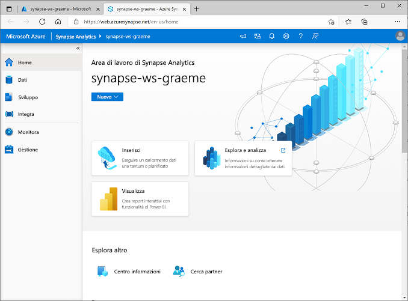
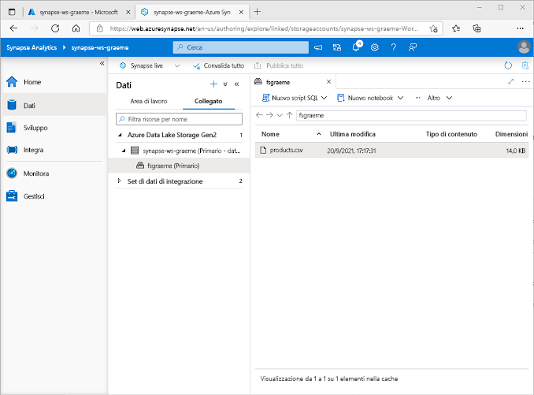
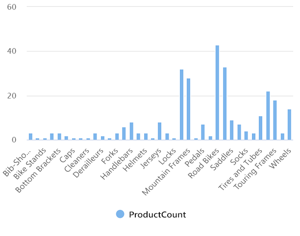
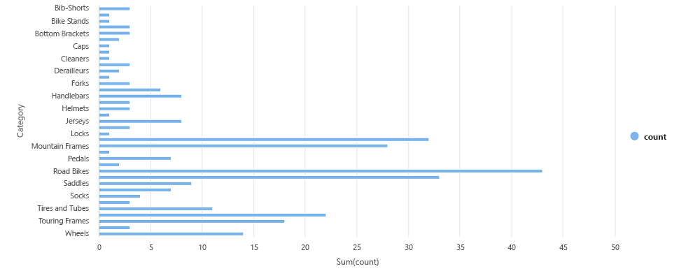

---
lab:
  title: Esplorare l'analisi dei dati in Azure con Azure Synapse Analytics
  module: Explore fundamentals of large-scale data warehousing
---

# Esplorare l'analisi dei dati in Azure con Azure Synapse Analytics

In questo esercizio si effettuerà il provisioning di un'area di lavoro di Azure Synapse Analytics nella sottoscrizione di Azure e la si userà per inserire ed eseguire query sui dati.

Il completamento di questo lab richiederà circa **30** minuti.

## Prima di iniziare

Sarà necessaria una [sottoscrizione di Azure](https://azure.microsoft.com/free) con accesso di livello amministrativo.

## Effettuare il provisioning di un'area di lavoro di Azure Synapse Analytics

Per usare Azure Synapse Analytics, è necessario effettuare il provisioning di una risorsa dell'area di lavoro di Azure Synapse Analytics nella sottoscrizione di Azure.

1. Aprire il portale di Azure all'indirizzo [https://portal.azure.com](https://portal.azure.com?azure-portal=true) ed eseguire l'accesso usando le credenziali associate alla sottoscrizione di Azure.

    > **Suggerimento**: assicurarsi di essere nella directory relativa alla sottoscrizione personale, indicata in alto a destra sotto l'ID utente. In caso contrario, selezionare l'icona utente e passare alla directory appropriata.

2. Nella **home page** del portale di Azure usare l'icona **&#65291; Crea una risorsa** per creare una nuova risorsa.
3. Cercare *Azure Synapse Analytics* e creare una nuova risorsa **Azure Synapse Analytics** con le impostazioni seguenti:
    - **Sottoscrizione**: *la sottoscrizione di Azure in uso*.
        - **Gruppo di risorse**: *creare un nuovo gruppo di risorse con un nome appropriato, ad esempio "synapse-rg"*
        - **Gruppo di risorse gestite**: *immettere un nome appropriato, ad esempio "synapse-managed-rg".*
    - **Nome dell'area di lavoro**: *immettere un nome univoco dell'area di lavoro, ad esempio "synapse-ws-<nome_utente>"*.
    - **Area**: *selezionare una delle aree seguenti*:
        - Australia orientale
        - Stati Uniti centrali
        - Stati Uniti orientali 2
        - Europa settentrionale
        - Stati Uniti centro-meridionali
        - Asia sud-orientale
        - Regno Unito meridionale
        - Europa occidentale
        - Stati Uniti occidentali
        - WestUS 2
    - **Selezionare Data Lake Storage Gen 2**: dalla sottoscrizione
        - **Nome dell'account**: *creare un nuovo account con un nome univoco, ad esempio "datalake<nome_utente>"*.
        - **Nome file system**: *creare un nuovo file system con un nome univoco, ad esempio "fs<nome_utente>"*.

    > **Nota**: per un'area di lavoro di Synapse Analytics sono necessari due gruppi di risorse nella sottoscrizione di Azure, uno per le risorse create in modo esplicito e un altro per le risorse gestite usate dal servizio. È inoltre necessario un account di archiviazione Data Lake in cui archiviare dati, script e altri artefatti.

4. Dopo aver immesso questi dettagli, selezionare **Rivedi e crea**, quindi selezionare **Crea** per creare l'area di lavoro.
5. Attendere che venga creata l'area di lavoro. L'operazione può richiedere circa cinque minuti.
6. Al termine della distribuzione, passare al gruppo di risorse creato e osservare che contiene l'area di lavoro di Synapse Analytics e un account di archiviazione Data Lake.
7. Selezionare l'area di lavoro di Synapse e nella relativa pagina **Panoramica**, nella scheda **Apri Synapse Studio**, selezionare **Apri** per aprire Synapse Studio in una nuova scheda del browser. Synapse Studio è un'interfaccia basata sul Web in cui è possibile usare l'area di lavoro di Synapse Analytics.
8. Sul lato sinistro di Synapse Studio usare l'icona **&rsaquo;&rsaquo;** per espandere il menu. Verranno visualizzate le varie pagine all'interno di Synapse Studio in cui è possibile gestire le risorse ed eseguire attività di analisi dei dati, come illustrato di seguito:

    

## Inserire i dati

Una delle attività chiave che è possibile eseguire con Azure Synapse Analytics consiste nel definire *pipeline* che trasferiscono (e, se necessario, trasformano) i dati provenienti da un'ampia gamma di origini nell'area di lavoro per l'analisi.

1. Nella **home page** di Synapse Studio selezionare **Inserisci** per aprire lo **strumento Copia dati**.
2. Nel passaggio **Proprietà** dello strumento Copia dati verificare che le opzioni **Attività di copia predefinita** ed **Esegui una volta solo ora** siano selezionate e fare clic su **Avanti >**.
3. Nel passaggio **Origine** selezionare le impostazioni seguenti nel passaggio secondario **Set di dati**:
    - **Tipo di origine**: Tutto
    - **Connessione**: *creare una nuova connessione e nel riquadro **Nuova connessione** visualizzato, nella scheda **Protocollo generico** selezionare **HTTP**. Continuare quindi con la creazione di una connessione a un file di dati usando le impostazioni seguenti:*
        - **Nome**: Prodotti AdventureWorks
        - **Descrizione**: Elenco prodotti tramite HTTP
        - **Connetti tramite runtime di integrazione**: AutoResolveIntegrationRuntime
        - **URL di base**: `https://raw.githubusercontent.com/MicrosoftLearning/DP-900T00A-Azure-Data-Fundamentals/master/Azure-Synapse/products.csv`
        - **Convalida certificato server**: abilitata
        - **Tipo di autenticazione**: Anonimo
4. Dopo aver creato la connessione, nel passaggio secondario **Origine/Set di dati** verificare che siano selezionate le impostazioni seguenti e quindi selezionare **Avanti >**:
    - **URL relativo**: *lasciare vuoto*
    - **Metodo di richiesta**: GET.
    - **Intestazioni aggiuntive**: *lasciare vuoto*
    - **Copia binaria**: <u>de</u>selezionata
    - **Timeout della richiesta**: *lasciare vuoto*
    - **Numero massimo di connessioni simultanee**: *lasciare vuoto*
5. Nel passaggio **Origine** selezionare **Anteprima dati** nel passaggio secondario **Configurazione** per visualizzare un'anteprima dei dati del prodotto che verranno inseriti nella pipeline e quindi chiudere l'anteprima.
6. Dopo aver visualizzato l'anteprima dei dati, nel passaggio **Origine/Configurazione** verificare che siano selezionate le impostazioni seguenti e quindi selezionare **Avanti >**:
    - **Formato file**: DelimitedText
    - **Delimitatore di colonna:** Virgola (,)
    - **Delimitatore di riga**: carattere di avanzamento riga (\n)
    - **Prima riga come intestazione**: selezionata
    - **Tipo di compressione:** Nessuno
7. Nel passaggio **Destinazione** selezionare le impostazioni seguenti nel passaggio secondario **Set di dati**:
    - **Tipo di destinazione**: Azure Data Lake Storage Gen 2
    - **Connessione**: *selezionare la connessione esistente all'archivio data lake, che è stato creato automaticamente quando si è creata l'area di lavoro.*
8. Dopo aver selezionato la connessione, nel passaggio **Destinazione/Set di dati** verificare che siano selezionate le impostazioni seguenti e quindi selezionare **Avanti >**:
    - **Percorso cartella**: *passare alla cartella del file system*
    - **Nome file**: products.csv
    - **Comportamento di copia**: Nessuno
    - **Numero massimo di connessioni simultanee**: *lasciare vuoto*
    - **Dimensioni blocco (MB)**: *lasciare vuoto*
9. Nel passaggio **Destinazione** assicurarsi che siano selezionate le proprietà seguenti nel passaggio secondario **Configurazione**. Quindi selezionare **Avanti >**:
    - **Formato file**: DelimitedText
    - **Delimitatore di colonna:** Virgola (,)
    - **Delimitatore di riga**: carattere di avanzamento riga (\n)
    - **Aggiungi intestazione al file**: selezionata
    - **Tipo di compressione:** Nessuno
    - **Numero massimo di righe per file**: *lasciare vuoto*
    - **Prefisso nome file**: *lasciare vuoto*
10. Nel passaggio **Impostazioni** immettere le impostazioni seguenti e quindi selezionare **Avanti >**:
    - **Nome attività**: Copia prodotti
    - **Descrizione attività**: Copia dei dati sui prodotti
    - **Tolleranza di errore**: *lasciare vuoto*
    - **Abilita registrazione**: <u>de</u>selezionata
    - **Abilita staging**: <u>de</u>selezionata
11. Nel passaggio **Rivedere e completare** leggere il riepilogo nel passaggio secondario **Rivedere** e quindi fare clic su **Avanti >**.
12. Nel passaggio secondario **Distribuzione** attendere la distribuzione della pipeline e quindi scegliere **Fine**.
13. In Synapse Studio selezionare la pagina **Monitoraggio** e nella scheda **Esecuzioni della pipeline** attendere che la pipeline **Copia prodotti** sia completata con stato **Riuscito** (è possibile usare il pulsante **&#8635; Aggiorna** nella pagina Esecuzioni della pipeline per aggiornare lo stato).
14. Nella pagina **Dati** selezionare la scheda **Collegato** ed espandere la gerarchia di **Azure Data Lake Storage Gen 2** fino a visualizzare la risorsa di archiviazione file per l'area di lavoro di Synapse. Selezionare quindi la risorsa di archiviazione file per verificare che un file denominato **products.csv** sia stato copiato in questo percorso, come illustrato di seguito:

    

## Usare un pool SQL per analizzare i dati

Dopo aver inserito alcuni dati nell'area di lavoro, è possibile usare Synapse Analytics per eseguire query e analizzarli. Uno dei modi più comuni per eseguire query sui dati consiste nell'uso di SQL e in Synapse Analytics è possibile usare un *pool SQL* per eseguire codice SQL.

1. In Synapse Studio fare clic con il pulsante destro del mouse sul file **products.csv** nella risorsa di archiviazione file per l'area di lavoro di Synapse, scegliere **Nuovo script SQL** e quindi **Seleziona le prime 100 righe**.
2. Nel riquadro **SQL Script 1** visualizzato esaminare il codice SQL generato, che dovrebbe essere simile al seguente:

    ```SQL
    -- This is auto-generated code
    SELECT
        TOP 100 *
    FROM
        OPENROWSET(
            BULK 'https://datalakexx.dfs.core.windows.net/fsxx/products.csv',
            FORMAT = 'CSV',
            PARSER_VERSION='2.0'
        ) AS [result]
    ```

    Questo codice apre un set di righe dal file di testo importato e recupera le prime 100 righe di dati.

3. Nell'elenco **Connetti a** verificare che sia selezionata l'opzione **Predefinito**, che rappresenta il pool SQL predefinito creato con l'area di lavoro.
4. Sulla barra degli strumenti usare il pulsante **&#9655; Esegui** per eseguire il codice SQL ed esaminare i risultati, che dovrebbero essere simili ai seguenti:

    | C1 | c2 | c3 | c4 |
    | -- | -- | -- | -- |
    | ProductID | ProductName | Categoria | ListPrice |
    | 771 | Mountain-100 argento, 38 | Mountain Bikes | 3399,9900 |
    | 772 | Mountain-100 Silver, 42 | Mountain Bikes | 3399,9900 |
    | ... | ... | ... | ... |

5. Si noti che i risultati sono costituiti da quattro colonne, denominate C1, C2, C3 e C4, e che la prima riga nei risultati contiene i nomi dei campi dati. Per risolvere questo problema, aggiungere un parametro HEADER_ROW = TRUE alla funzione OPENROWSET, come illustrato qui (sostituendo *datalakexx* e *fsxx* con i nomi dell'account di archiviazione di Data Lake e del file system) e quindi eseguire nuovamente la query:

    ```SQL
    SELECT
        TOP 100 *
    FROM
        OPENROWSET(
            BULK 'https://datalakexx.dfs.core.windows.net/fsxx/products.csv',
            FORMAT = 'CSV',
            PARSER_VERSION='2.0',
            HEADER_ROW = TRUE
        ) AS [result]
    ```

    Ora i risultati saranno simili ai seguenti:

    | ProductID | ProductName | Categoria | ListPrice |
    | -- | -- | -- | -- |
    | 771 | Mountain-100 argento, 38 | Mountain Bikes | 3399,9900 |
    | 772 | Mountain-100 Silver, 42 | Mountain Bikes | 3399,9900 |
    | ... | ... | ... | ... |

6. Modificare la query nel modo seguente (sostituendo *datalakexx* e *fsxx* con i nomi dell'account di archiviazione di Data Lake e del file system):

    ```SQL
    SELECT
        Category, COUNT(*) AS ProductCount
    FROM
        OPENROWSET(
            BULK 'https://datalakexx.dfs.core.windows.net/fsxx/products.csv',
            FORMAT = 'CSV',
            PARSER_VERSION='2.0',
            HEADER_ROW = TRUE
        ) AS [result]
    GROUP BY Category;
    ```

7. Eseguire la query modificata, che dovrebbe restituire un set di risultati contenente il numero di prodotti in ciascuna categoria, come illustrato di seguito:

    | Categoria | ProductCount |
    | -- | -- |
    | Bib Shorts | 3 |
    | Bike Racks | 1 |
    | ... | ... |

8. Nel riquadro **Proprietà** per **SQL Script 1** modificare il valore di **Nome** in **Conteggio prodotti per categoria**. Nella barra degli strumenti selezionare **Pubblica** per salvare lo script.

9. Chiudere il riquadro dello script **Conteggio prodotti per categoria**.

10. In Synapse Studio selezionare la pagina **Sviluppo** e osservare che lo script SQL **Conteggio prodotti per categoria** è stato salvato in tale percorso.

11. Selezionare lo script SQL **Conteggio prodotti per categoria** per riaprirlo. Assicurarsi quindi che lo script sia connesso al pool SQL **Predefinito** ed eseguirlo per recuperare i conteggi dei prodotti.

12. Nel riquadro **Risultati** selezionare la visualizzazione **Grafico** e quindi selezionare le impostazioni seguenti per il grafico:
    - **Tipo di grafico**: Istogramma
    - **Colonna categoria**: Categoria
    - **Colonne legenda (serie)**: ProductCount
    - **Posizione legenda**: in basso al centro
    - **Etichetta legenda (serie)**: *lasciare vuoto*
    - **Valore minimo legenda (serie)**: *lasciare vuoto*
    - **Valore massimo legenda (serie)**: *lasciare vuoto*
    - **Etichetta categorie**: *lasciare vuoto*

    Il grafico risultante dovrebbe essere simile al seguente:

    

## Usare un pool SQL per analizzare i dati

Anche se SQL è un linguaggio comune per l'esecuzione di query su set di dati strutturati, molti analisti di dati trovano utili i linguaggi come Python per esplorare e preparare i dati per l'analisi. In Azure Synapse Analytics è possibile eseguire codice Python (e di altro tipo) in un *pool di Spark*, che usa un motore di elaborazione dati distribuito basato su Apache Spark.

1. In Synapse Studio selezionare la pagina **Gestisci**.
2. Selezionare la scheda **Pool di Apache Spark** e quindi usare l'icona **&#65291; Nuovo** per creare un nuovo pool di Spark con le impostazioni seguenti:
    - **Nome del pool di Apache Spark**: spark
    - **Famiglia di dimensioni del nodo**: Con ottimizzazione per la memoria
    - **Dimensioni nodo**: Piccolo (4 vCore/32 GB)
    - **Scalabilità automatica**: abilitata
    - **Numero di nodi** 3----3
3. Esaminare e creare il pool di Spark e quindi attendere la distribuzione (che potrebbe richiedere alcuni minuti).
4. Quando il pool di Spark è stato distribuito, nella pagina **Dati** di Synapse Studio passare al file system per l'area di lavoro di Synapse. Fare quindi clic con il pulsante destro del mouse su **products.csv**, scegliere **Nuovo notebook** e quindi **Carica nel dataframe**.
5. Nel riquadro **Notebook 1** visualizzato, selezionare il pool di Spark **spark** creato in precedenza dall'elenco **Connetti a** e assicurarsi che il campo **Linguaggio** sia impostato su **PySpark (Python)**.
6. Esaminare il codice nella prima (e unica) cella del notebook, che dovrebbe avere l'aspetto seguente:

    ```Python
    %%pyspark
    df = spark.read.load('abfss://fsxx@datalakexx.dfs.core.windows.net/products.csv', format='csv'
    ## If header exists uncomment line below
    ##, header=True
    )
    display(df.limit(10))
    ```

7.  Selezionare **&#9655; Esegui** a sinistra della cella di codice per eseguirla e attendere i risultati. La prima volta che si esegue una cella in un notebook, viene avviato il pool di Spark. Potrebbe quindi essere necessario attendere circa un minuto prima che vengano restituiti i risultati.

    > **Nota**: se si verifica un errore perché il kernel Python non è ancora disponibile, eseguire di nuovo la cella.

8. Alla fine, i risultati dovrebbero comparire sotto la cella e avere un aspetto simile al seguente:

    | _c0_ | _c1_ | _c2_ | _c3_ |
    | -- | -- | -- | -- |
    | ProductID | ProductName | Categoria | ListPrice |
    | 771 | Mountain-100 argento, 38 | Mountain Bikes | 3399,9900 |
    | 772 | Mountain-100 Silver, 42 | Mountain Bikes | 3399,9900 |
    | ... | ... | ... | ... |

9. Rimuovere il commento dalla riga *,header=True* perché il file products.csv contiene le intestazioni di colonna nella prima riga. Il codice sarà simile al seguente:

    ```Python
    %%pyspark
    df = spark.read.load('abfss://fsxx@datalakexx.dfs.core.windows.net/products.csv', format='csv'
    ## If header exists uncomment line below
    , header=True
    )
    display(df.limit(10))
    ```

10. Eseguire nuovamente la cella e verificare che i risultati siano simili ai seguenti:

    | ProductID | ProductName | Categoria | ListPrice |
    | -- | -- | -- | -- |
    | 771 | Mountain-100 argento, 38 | Mountain Bikes | 3399,9900 |
    | 772 | Mountain-100 Silver, 42 | Mountain Bikes | 3399,9900 |
    | ... | ... | ... | ... |

    Si noti che l'esecuzione della cella richiede meno tempo, perché il pool di Spark è già stato avviato.

11. Nei risultati usare l'icona **&#65291; Codice** per aggiungere una nuova cella di codice al notebook.
12. Nella nuova cella vuota aggiungere il codice seguente:

    ```Python
    df_counts = df.groupBy(df.Category).count()
    display(df_counts)
    ```

13. Selezionare **&#9655; Esegui** a sinistra per eseguire la nuova cella di codice ed esaminare i risultati, che dovrebbero essere simili ai seguenti:

    | Categoria | numero |
    | -- | -- |
    | Headsets | 3 |
    | Ruote | 14 |
    | ... | ... |

14. Nell'output dei risultati della cella selezionare la visualizzazione **Grafico**. Il grafico risultante dovrebbe essere simile al seguente:

    

15. Chiudere il riquadro **Notebook 1** ed eliminare le modifiche.

## Eliminare le risorse di Azure

Al termine dell'esplorazione di Azure Synapse Analytics, è necessario eliminare le risorse create per evitare costi di Azure non necessari.

1. Chiudere la scheda del browser di Synapse Studio e tornare al portale di Azure.
2. Nella **home page** del portale di Azure selezionare **Gruppi di risorse**.
3. Selezionare il gruppo di risorse per l'area di lavoro di Synapse Analytics (non il gruppo di risorse gestito) e verificare che contenga l'area di lavoro di Synapse, l'account di archiviazione e il pool di Spark per l'area di lavoro.
4. Nel parte superiore della pagina **Panoramica** del gruppo di risorse selezionare **Elimina gruppo di risorse**.
5. Immettere il nome del gruppo di risorse per confermare l'eliminazione e selezionare **Elimina**.

    Dopo alcuni minuti, l'area di lavoro di Azure Synapse e l'area di lavoro gestita associata verranno eliminate.
