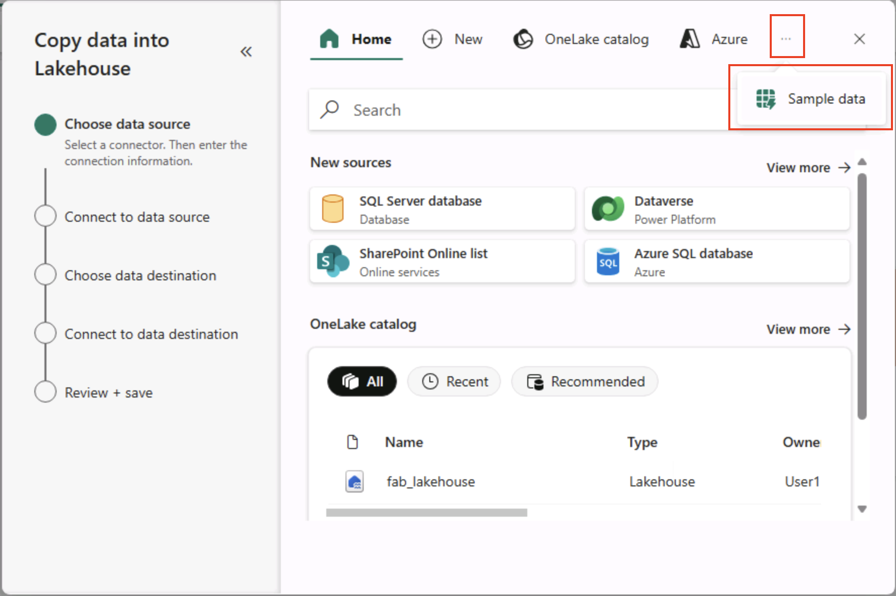

---
lab:
  title: Esplorare l'analisi dei dati in Microsoft Fabric
  module: Explore fundamentals of large-scale data analytics
---

# Esplorare l'analisi dei dati in Microsoft Fabric

In questo esercizio saranno esaminati l'inserimento e l'analisi dei dati in un lakehouse di Microsoft Fabric.

Completando questo lab, si eseguiranno le operazioni seguenti:

- **Informazioni sui concetti di** Microsoft Fabric Lakehouse: informazioni su come creare aree di lavoro e lakehouse, che sono fondamentali per organizzare e gestire gli asset di dati in Fabric.
- **Inserire dati usando le** pipeline: usare una pipeline guidata per inserire dati esterni nel lakehouse, rendendoli pronti per le query senza scrivere codice manuale.
- **Esplorare ed eseguire query sui dati con SQL**: analizzare i dati inseriti usando query SQL familiari, ottenendo informazioni dettagliate direttamente all'interno di Fabric.
- **Gestire le risorse**: informazioni sulle procedure consigliate per la pulizia delle risorse per evitare addebiti non necessari.

## Informazioni generali sul set di dati nyc Taxi:

Il set di dati "NYC Taxi - Green" contiene record dettagliati delle corse in taxi a New York City, inclusi orari di ritiro e consegna, località, distanze di viaggio, tariffe e conteggi dei passeggeri. Viene ampiamente usato nell'analisi dei dati e nell'apprendimento automatico per esplorare la mobilità urbana, la previsione della domanda e il rilevamento delle anomalie. In questo lab si userà questo set di dati reale per praticare l'inserimento e l'analisi dei dati in Microsoft Fabric.

Il completamento di questo lab richiederà circa **25** minuti.

> **Nota**: per completare questo esercizio è necessaria una licenza di Microsoft Fabric. Per informazioni dettagliate su come abilitare una licenza di prova gratuita di Fabric, vedere [Introduzione a Fabric](https://learn.microsoft.com/fabric/get-started/fabric-trial). Per eseguire questa operazione, è necessario anche un account Microsoft *dell'istituto di istruzione* o *aziendale*. Se non è disponibile, è possibile [iscriversi per ottenere una versione di valutazione di Microsoft Office 365 E3 o versione successiva](https://www.microsoft.com/microsoft-365/business/compare-more-office-365-for-business-plans).

*La prima volta che si usano le funzionalità di Microsoft Fabric, potrebbero essere visualizzate richieste con suggerimenti. Ignorare questi elementi.*

## Creare un'area di lavoro

Prima di usare i dati in Fabric, creare un'area di lavoro con la versione di valutazione di Fabric abilitata.

> _**Suggerimento**: un'area di lavoro è il contenitore per tutti gli asset (lakehouses, pipeline, notebook, report). L'abilitazione della capacità infrastruttura consente l'esecuzione di questi elementi._

1. Passare alla [home page](https://app.fabric.microsoft.com/home?experience=fabric) di Microsoft Fabric in `https://app.fabric.microsoft.com/home?experience=fabric` un browser e accedere con le credenziali di Fabric.

1. Nella barra dei menu a sinistra selezionare **Aree di lavoro** (l'icona è simile a &#128455;).

    

1. Creare una nuova area di lavoro con un nome di propria scelta, selezionando una modalità di licenza nella sezione **Avanzate** che include la capacità di Fabric (*versione di valutazione*, *Premium* o *Fabric*).

    > _**Suggerimento** Selezionare una capacità che include Fabric fornisce all'area di lavoro i motori necessari per le attività di ingegneria dei dati. L'uso di un'area di lavoro dedicata mantiene isolate e facili da pulire le risorse del lab._

1. Quando si apre la nuova area di lavoro, deve essere vuota.

    

## Creare un lakehouse

Ora che si dispone di un'area di lavoro, è possibile creare una lakehouse per i file di dati.

> _**Suggerimento**: una lakehouse riunisce file e tabelle su OneLake. È possibile archiviare file non elaborati e anche creare tabelle Delta gestite su cui è possibile eseguire query con SQL._

1. Sulla barra dei menu a sinistra selezionare **Crea**. Nella sezione Ingegneria dei dati* della ** pagina Nuovo* selezionare **Lakehouse**. Assegnargli un nome univoco di propria scelta.

    >**Nota**: se l'opzione **Crea** non è aggiunta alla barra laterale, è necessario selezionare prima i puntini di sospensione (**...**).

    

    Dopo circa un minuto, verrà creata un nuovo lakehouse:

    

1. Visualizzare il nuovo lakehouse e tenere presente che il riquadro **Lakehouse Explorer** a sinistra consente di esplorare tabelle e file al suo interno:
   
    - La **cartella Tabelle** contiene tabelle su cui è possibile eseguire query usando la semantica SQL. Le tabelle in un lakehouse di Microsoft Fabric si basano sul formato di file open source *Delta Lake* comunemente usato in Apache Spark.
    - La cartella **File** contiene i file di dati nell'archivio OneLake del lakehouse che non sono associati alle tabelle delta gestite. In questa cartella è anche possibile creare *scelte rapide* per fare riferimento ai dati archiviati esternamente.

    Attualmente non sono presenti tabelle o file nel lakehouse.

    > _**Suggerimento**: usare i file per i dati non elaborati o a fasi e le tabelle per set di dati curati e pronti per le query. Le tabelle sono supportate da Delta Lake in modo da supportare aggiornamenti affidabili e query efficienti._

## Inserire i dati

Un modo semplice per inserire dati consiste nell'usare un'attività **Copia dati** in una pipeline per estrarre i dati da un'origine e copiarli in un file nel lakehouse.

> _**Suggerimento**: le pipeline offrono un modo guidato e ripetibile per inserire i dati nel lakehouse. Sono più facili rispetto alla scrittura di codice da zero e possono essere pianificati in un secondo momento, se necessario._

1. **Nella home** page del lakehouse, nel **menu Recupera dati** selezionare **Nuova pipeline** di dati e creare una nuova pipeline di dati denominata **Ingest Data**.

    

1. Nella pagina Scegliere un'origine** dati della ****procedura guidata Copia dati** selezionare Dati** di esempio **e quindi selezionare il **set di dati di esempio NYC Taxi - Green**.

    

    

1. Nella pagina Connetti all'origine **** dati visualizzare le tabelle nell'origine dati. Dovrebbe essere presente una tabella che contiene i dettagli delle corse in taxi a New York City. Selezionare **quindi Avanti** per passare alla **pagina Connetti alla destinazione** dati.

1. Nella **pagina Connetti a destinazione** dati impostare le opzioni di destinazione dati seguenti e quindi selezionare **Avanti**:
    - **Cartella radice**: tabelle
    - **Impostazioni di caricamento**: caricare in una nuova tabella
    - **Nome tabella di destinazione**: taxi_rides *(potrebbe essere necessario attendere la visualizzazione dell'anteprima dei mapping delle colonne prima di poter modificare questa impostazione)*
    - **Mapping delle colonne**: *lasciare invariati i mapping predefiniti*
    - **Abilita partizione**: *deselezionata*

    

    > _**Perché queste scelte?**_
    > 
    > _Si inizia con Tabelle come **radice** in modo che i dati passino direttamente in una tabella Delta gestita, che è possibile eseguire immediatamente una query. Il caricamento viene eseguito in una **nuova tabella** in modo che questo lab rimanga indipendente e che non venga sovrascritto nulla di esistente. I mapping delle colonne predefinite** verranno usati **perché i dati di esempio corrispondono già alla struttura prevista, senza alcun mapping personalizzato necessario. **** Il partizionamento è disattivato per semplificare questo piccolo set di dati. Mentre il partizionamento è utile per i dati su larga scala, non è necessario qui._

1. Nella pagina **Rivedi e salva** verificare che l'opzione **Avvia trasferimento dati immediatamente** sia selezionata e quindi selezionare **Salva e Esegui**.

    > _**Suggerimento**: l'avvio immediato consente di controllare la pipeline in azione e di confermare l'arrivo dei dati senza passaggi aggiuntivi._

    Viene creata una nuova pipeline contenente un'attività **Copia dati**, come illustrato di seguito:

    

    Quando l'esecuzione della pipeline viene avviata, è possibile monitorarne lo stato nel riquadro **Output** nella finestra di progettazione della pipeline. Usare l'icona **&#8635;** (*Aggiorna*) per aggiornare lo stato e attendere il completamento (che potrebbe richiedere più di 10 minuti). Questo particolare set di dati contiene più di 75 milioni di righe, archiviando circa 2,5 GB di dati. 

1. Nella barra dei menu dell'hub a sinistra selezionare il lakehouse.

    

1. **Nella home** page, nel **riquadro Lakehouse Explorer**, nel **menu ...** per il **nodo Tabelle** selezionare **Aggiorna** e quindi espandere **Tabelle** per verificare che la **tabella taxi_rides** sia stata creata.

    

    > **Nota**: se la nuova tabella è elencata come *non identificata*, usare l'opzione **di menu Aggiorna** per aggiornare la visualizzazione.

    > _**Suggerimento**: la visualizzazione Explorer viene memorizzata nella cache. L'aggiornamento forza il recupero dei metadati della tabella più recenti in modo che la nuova tabella venga visualizzata correttamente._

1. Selezionare la **tabella taxi_rides** per visualizzarne il contenuto.

    

## Eseguire query sui dati nel lakehouse

Ora che i dati sono stati inseriti in una tabella nel lakehouse, è possibile usare SQL per eseguire le query.

> _**Suggerimento**: le tabelle Lakehouse sono compatibili con SQL. È possibile analizzare immediatamente i dati senza spostarli in un altro sistema._

1. Nella parte superiore destra della pagina Lakehouse passare dalla **visualizzazione Lakehouse** all'endpoint **** di analisi SQL per il lakehouse.

    

    > _**Suggerimento**: l'endpoint di analisi SQL è ottimizzato per l'esecuzione di query SQL sulle tabelle lakehouse e si integra con strumenti di query familiari._

1. Selezionare **Nuova query SQL** sulla barra degli strumenti. Nel riquadro dell'editor di query, immettere il seguente codice SQL:

    ```sql
    SELECT  DATENAME(dw,lpepPickupDatetime) AS Day,
            AVG(tripDistance) As AvgDistance
    FROM taxi_rides 
    GROUP BY DATENAME(dw,lpepPickupDatetime)
    ```

1. Selezionare il **&#9655; Pulsante Esegui** per eseguire la query ed esaminare i risultati, che devono includere la distanza media delle corse per ogni giorno della settimana.

    > _**Suggerimento**: questa query raggruppa i viaggi in base al nome del giorno e calcola la distanza media, mostrando un semplice esempio di aggregazione su cui è possibile eseguire la compilazione._

    

## Pulire le risorse

Se è stata completata l'esplorazione di Microsoft Fabric, è possibile eliminare l'area di lavoro creata per questo esercizio.

> _**Suggerimento**: l'eliminazione dell'area di lavoro rimuove tutti gli elementi creati nel lab e consente di evitare addebiti in corso._

1. Nella barra a sinistra selezionare l'icona dell'area di lavoro per visualizzare tutti gli elementi contenuti.

1. Nella barra degli strumenti selezionare **Impostazioni** area di lavoro.

1. **Nella sezione Generale** selezionare **Rimuovi questa area di lavoro**.
