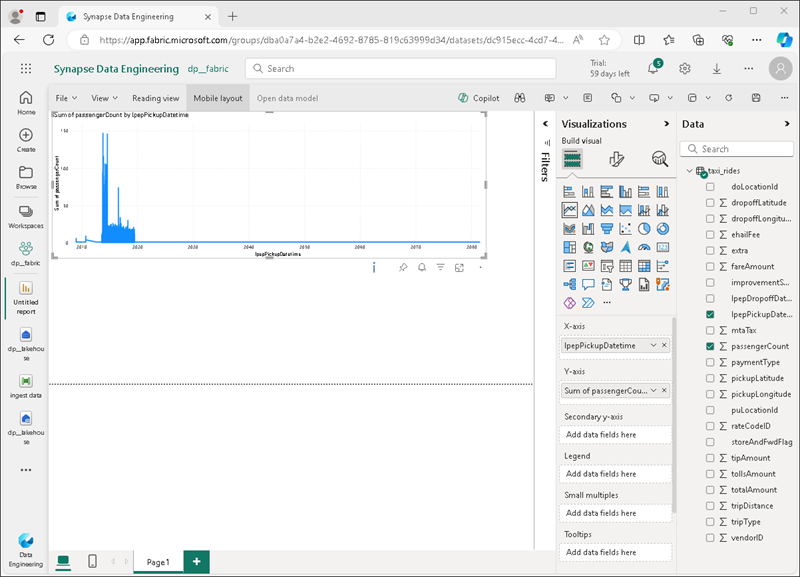

---
lab:
  title: Esplorare l'analisi dei dati in Microsoft Fabric
  module: Explore fundamentals of large-scale data analytics
---

# Esplorare l'analisi dei dati in Microsoft Fabric

In questo esercizio si esaminerà l'inserimento e l'analisi dei dati in microsoft Fabric Lakehouse.

Il completamento di questo lab richiederà circa **25** minuti.

> **Nota**: è necessaria una licenza di Microsoft Fabric per completare questo esercizio. Per informazioni dettagliate su come abilitare una licenza di valutazione gratuita di Fabric, vedere [Introduzione a Fabric](https://learn.microsoft.com/fabric/get-started/fabric-trial) . Per eseguire questa operazione sarà necessario *un account* *aziendale o dell'istituto di istruzione* Microsoft. Se non ne hai uno, puoi [iscriverti per una versione di valutazione di Microsoft Office 365 E3 o successiva](https://www.microsoft.com/microsoft-365/business/compare-more-office-365-for-business-plans).

## Creare un'area di lavoro

Prima di usare i dati in Fabric, creare un'area di lavoro con la versione di valutazione di Fabric abilitata.

1. Accedere a [Microsoft Fabric](https://app.fabric.microsoft.com) all'indirizzo `https://app.fabric.microsoft.com`.
2. Nella barra dei menu a sinistra selezionare **Aree** di lavoro (l'icona è simile a &#128455;).
3. Creare una nuova area di lavoro con un nome scelto, selezionando una modalità di licenza nella sezione **Avanzate** che include capacità infrastruttura (*Versione di valutazione*, *Premium* o *Fabric*).
4. Quando si apre la nuova area di lavoro, deve essere vuota.

    

## Creare una lakehouse

Ora che si dispone di un'area di lavoro, è possibile passare all'esperienza di *progettazione dei dati* nel portale e creare una data lakehouse per i file di dati.

1. Nella parte inferiore sinistra del portale passare all'esperienza **di Ingegneria dei dati**.

    

    La home page dell'ingegneria dei dati include riquadri per creare asset di ingegneria dei dati comunemente usati.

2. Nella home page **Progettazione dati** creare un nuovo **Lakehouse** con un nome di propria scelta.

    Dopo un minuto o così, verrà creato un nuovo lakehouse:

    

3. Visualizzare il nuovo lakehouse e notare che il riquadro Esplora **lakehouse** a sinistra consente di esplorare tabelle e file nella lakehouse:
    - La cartella **Tabelle** contiene tabelle che è possibile eseguire query tramite SQL. Le tabelle in una Microsoft Fabric lakehouse si basano sul formato di file *Delta Lake* open source comunemente usato in Apache Spark.
    - La cartella **File** contiene i file di dati nell'archivio OneLake per la lakehouse che non sono associati alle tabelle delta gestite. È anche possibile creare *collegamenti* in questa cartella per fare riferimento ai dati archiviati esternamente.

    Attualmente non sono presenti tabelle o file nella lakehouse.

## Inserire dati

Un modo semplice per inserire i dati consiste nell'usare un'attività **Copia dati** in una pipeline per estrarre i dati da un'origine e copiarla in un file in lakehouse.

1. Nella **home** page per il lakehouse selezionare **Nuova pipeline** di **dati** e creare una nuova pipeline di dati denominata **Inserimento dati**.
1. Nella procedura guidata **Copia dati** selezionare il set di dati **di esempio Wide World Importers** nella pagina **Scegli un'origine dati dati**.

    

1. Selezionare **Avanti** e visualizzare le tabelle **nell'origine dati nella pagina Connetti all'origine dati** .
1. Selezionare la tabella **dimension_stock_item** che contiene i record dei prodotti. Selezionare **Quindi Avanti** per passare alla pagina **Scegli destinazione dati** .
1. Nella pagina **Scegli destinazione dati** selezionare la lakehouse esistente. Fare quindi clic su **Avanti**.
1. Impostare le opzioni di destinazione dati seguenti e quindi selezionare **Avanti**:
    - **Cartella radice**: Tabelle
    - **Impostazioni di caricamento: Caricare** in una nuova tabella
    - **Nome tabella di destinazione**: dimProduct
    - **Mapping di colonne**: *lasciare i mapping predefiniti come è*
    - **Abilitare la partizione**: *Deselezionata*
1. Nella pagina **Rivedi _ salva** assicurarsi che l'opzione **Avvia trasferimento dati sia** selezionata immediatamente e quindi selezionare **Salva + Esegui**.

    Viene creata una nuova pipeline contenente un'attività **Copia dati** , come illustrato di seguito:

    

    Quando la pipeline inizia a essere eseguita, è possibile monitorare lo stato nel riquadro **Output** nella finestra di progettazione della pipeline. Usare l'icona **&#8635;** (*aggiornamento*) per aggiornare lo stato e attendere fino a quando non è riuscita.

1. Nella barra dei menu dell'hub a sinistra selezionare la tua lakehouse.
1. Nella **home** page, nel riquadro Esplora **lakehouse** espandere **Tabelle** e verificare che sia stata creata la tabella **dimProduct** .

    > **Nota**: se la nuova tabella è *elencata come non identificata*, usare il pulsante **Aggiorna** nella barra degli strumenti lakehouse per aggiornare la visualizzazione.

1. Selezionare la tabella **dimProduct** per visualizzarne il contenuto.

    

## Eseguire query sui dati in una lakehouse

Dopo aver inserito i dati in una tabella nella lakehouse, è possibile usare SQL per eseguirne una query.

1. Nella parte superiore destra della pagina Lakehouse passare **all'endpoint SQL** per la tua lakehouse.

    

1. Nella barra degli strumenti selezionare **Nuova query SQL**. Immettere quindi il codice SQL seguente nell'editor di query:

    ```sql
    SELECT Brand, COUNT(StockItemKey) AS Products
    FROM dimProduct
    GROUP BY Brand
    ```

1. Selezionare il pulsante **&#9655; Esegui** per eseguire la query e esaminare i risultati, che dovrebbero rivelare che sono presenti due valori di marca (*N/A* e *Northwind*) e visualizzare il numero di prodotti in ognuno.

    

## Visualizzare i dati in una lakehouse

Microsoft Fabric lakehouses organizza tutte le tabelle in un modello di dati, che è possibile usare per creare visualizzazioni e report.

1. Nella parte inferiore sinistra della pagina, nel riquadro **Esplora** selezionare la scheda **Modello** per visualizzare il modello di dati per le tabelle nella lakehouse (in questo caso è presente una sola tabella).

    

1. Nella barra degli strumenti selezionare **Nuovo report** per aprire una nuova scheda del browser contenente la finestra di progettazione report di Power BI.
1. Nella finestra di progettazione report:
    1. Nel riquadro **Dati** espandere la tabella **dimProduct** e selezionare i campi **Brand** e **StockItemKey** .
    1. Nel riquadro **Visualizzazioni** selezionare la visualizzazione grafico a **barre in pila** (è la prima elencata). Assicurarsi quindi che **l'asse Y** contenga il campo **Brand** e modificare l'aggregazione **nell'asse X** in **Count** in modo che contenga il campo **Count of StockItemKey** .
    
        

    > **Suggerimento**: è possibile usare le icone per nascondere i **>>** riquadri della finestra di progettazione report per visualizzare più chiaramente il report.

1. Nel menu **File** selezionare **Salva** per salvare il report come **Report quantità marchio** nell'area di lavoro Fabric.

    È possibile chiudere la scheda del browser conta8 il report per tornare alla tua lakehouse. È possibile trovare il report nella pagina per l'area di lavoro nel portale di Microsoft Fabric.

## Pulire le risorse

Se è stata completata l'esplorazione di Microsoft Fabric, è possibile eliminare l'area di lavoro creata per questo esercizio.

1. Nella barra a sinistra selezionare l'icona per l'area di lavoro per visualizzare tutti gli elementi contenuti.
2. Nel menu **...** sulla barra degli strumenti selezionare **Impostazioni area di lavoro**.
3. Nella sezione **Altre** selezionare **Rimuovi questa area di lavoro**.
