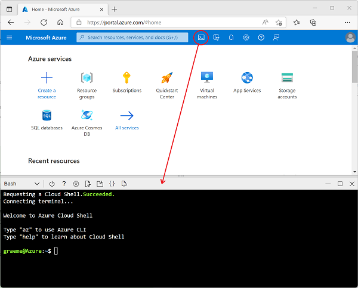

---
lab:
  title: Esplorare Analisi di flusso di Azure
  module: Explore data analytics in Azure
ms.openlocfilehash: 925607333098d0774839d705d4e055a78e32de27
ms.sourcegitcommit: e73a39e323ef061919b58561ff1afdca876ad2b5
ms.translationtype: HT
ms.contentlocale: it-IT
ms.lasthandoff: 04/07/2022
ms.locfileid: "141493692"
---
## Esplorare Analisi di flusso di Azure

In questo esercizio si effettuerà il provisioning di un processo di Analisi di flusso di Azure nella sottoscrizione di Azure e lo si userà per elaborare un flusso di dati in tempo reale.

> **Nota**: l'esercizio fa parte di un modulo di Microsoft Learn e include un'opzione per usare una sottoscrizione di Azure *sandbox*. Se tuttavia si completa questo esercizio durante un corso con docente, è consigliabile usare la sottoscrizione di Azure fornita durante il corso invece della sandbox.

Prima di iniziare l'esercizio in Microsoft Learn, sarà necessario preparare un ambiente Cloud Shell per la sottoscrizione di Azure.

1. Accedere alla sottoscrizione di Azure nel [portale di Azure](https://portal.azure.com) all'indirizzo `https://portal.azure.com`, usando le credenziali della sottoscrizione di Azure.
2. Usare il pulsante **[\>_]** a destra della barra di ricerca, nella parte superiore della pagina, per aprire una nuova sessione di Cloud Shell nel portale di Azure selezionando un ambiente **_Bash_** e creando spazio di archiviazione, se richiesto. Cloud Shell fornisce un'interfaccia della riga di comando in un riquadro nella parte inferiore del portale di Azure, come illustrato di seguito:

    

3. Si noti che è possibile ridimensionare Cloud Shell trascinando la barra di separazione nella parte superiore del riquadro o usando le icone **&#8212;** , **&#9723;** e **X** nell'angolo in alto a destra del riquadro per ridurre a icona, ingrandire o chiudere il riquadro. Per altre informazioni sull'uso di Azure Cloud Shell, vedere la [documentazione su Azure Cloud Shell](https://docs.microsoft.com/azure/cloud-shell/overview).

4. A questo punto si è pronti per completare l'esercizio in Microsoft Learn: è sufficiente usare Cloud Shell nel portale di Azure invece della shell vuota nel modulo di Learn (disponibile per gli studenti autogestiti che usano una sottoscrizione sandbox).

    Usare il collegamento seguente per aprire l'esercizio in Microsoft Learn.

    **[Vai a Microsoft Learn](https://docs.microsoft.com/learn/modules/explore-fundamentals-stream-processing/5-exercise-stream-analytics#create-azure-resources)**

> **Approfondimenti**: con più a tempo a disposizione, valutare la possibilità di tornare a questo modulo di Microsoft Learn e di provare gli altri esercizi disponibili, tra cui l'esplorazione di Spark Streaming e di Esplora dati di Azure Synapse.
