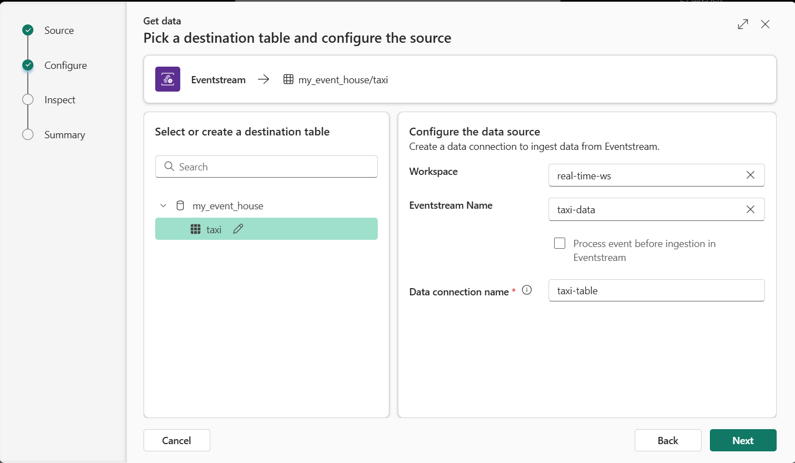

---
lab:
  title: Esplorare analisi in tempo reale in Microsoft Fabric
  module: Explore real-time analytics in Microsoft Fabric
---

# Esplorare analisi in tempo reale in Microsoft Fabric

Microsoft Fabric offre funzionalità di intelligence in tempo reale, consentendo di creare soluzioni analitiche per flussi di dati in tempo reale. In questo esercizio si useranno le funzionalità di Intelligence in tempo reale in Microsoft Fabric per inserire, analizzare e visualizzare un flusso di dati in tempo reale da una società di taxi.

Il laboratorio richiede circa **30** minuti per essere completato.

> **Nota**: per completare questo esercizio è necessario un [tenant](https://learn.microsoft.com/fabric/get-started/fabric-trial) di Microsoft Fabric.

## Creare un'area di lavoro

Prima di usare i dati in Fabric, è necessario creare un'area di lavoro con la capacità infrastruttura abilitata.

> _**Suggerimento**: un'area di lavoro è il contenitore per tutto ciò che si crea (eventstreams, eventhouses, dashboard). La capacità dell'infrastruttura consente l'esecuzione di questi elementi._

1. Passare alla [home page](https://app.fabric.microsoft.com/home?experience=fabric) di Microsoft Fabric in `https://app.fabric.microsoft.com/home?experience=fabric` un browser e accedere con le credenziali di Fabric.

1. Nella barra dei menu a sinistra selezionare **Aree di lavoro** (l'icona è simile a &#128455;).

1. Creare una nuova area di lavoro con un nome di propria scelta, selezionando una modalità di licenza che include capacità infrastruttura (*versione di valutazione*, *Premium* o *Infrastruttura*).

    > _**Suggerimento**: l'uso di una capacità che include Fabric garantisce che l'area di lavoro disponga dei motori necessari per l'inserimento e l'analisi in tempo reale. Un'area di lavoro separata mantiene le risorse del lab isolate e facili da pulire._

1. Quando si apre la nuova area di lavoro, deve essere vuota.

    

## Creare un flusso di eventi

A questo momento è possibile trovare e inserire dati in tempo reale da un'origine di streaming. A tale scopo, si inizierà nell'hub in tempo reale dell'infrastruttura.

> _**Suggerimento**: l'hub in tempo reale centralizza le origini di streaming e semplifica la connessione. Un flusso di eventi aggiunge le origini alle destinazioni e può aggiungere trasformazioni tra di loro._

> **Suggerimento**: la prima volta che si usa l'hub in tempo reale, potrebbero essere visualizzati alcuni *suggerimenti introduttivi* . È possibile chiuderli.

1. Nella barra dei menu a sinistra selezionare l'hub **in tempo** reale.

    L'hub in tempo reale offre un modo semplice per trovare e gestire origini di dati di streaming.

    

1. Nella sezione Connetti a nell'hub **in tempo reale selezionare **Origini dati**.**

1. Trovare l'origine dati dell'esempio **di taxi** giallo e selezionare **Connetti**. Quindi, nella **procedura guidata Connetti** assegnare un nome all'origine `taxi` e modificare il nome del flusso di eventi predefinito per modificarlo in `taxi-data`. Il flusso predefinito associato a questi dati verrà denominato *automaticamente taxi-data-stream*:

    > _**Suggerimento**: l'esempio di taxi giallo è un flusso pubblico sicuro, senza credenziali necessarie, ed è coerente per tutti gli studenti. Cancellare i nomi semplificano la ricerca dell'origine, del flusso di eventi e del flusso in un secondo momento._

    

1. Selezionare **Avanti** e attendere la creazione dell'origine e del flusso di eventi, quindi selezionare **Apri eventstream**. Il flusso di eventi mostrerà l'origine **dei taxi** e il **flusso taxi-data-stream** nell'area di disegno:

   

## Creare una eventhouse

Il flusso di eventi inserisce i dati dei taxi in tempo reale, ma attualmente non esegue alcuna operazione. Verrà ora creata una eventhouse in cui è possibile archiviare i dati acquisiti in una tabella.

> _**Suggerimento**: una eventhouse offre una risorsa di archiviazione durevole e un database KQL in modo da poter rendere persistente il flusso ed eseguirne query in un secondo momento, anche quando arrivano nuovi eventi. KQL (Linguaggio di query Kusto) è un linguaggio simile a SQL di sola lettura usato per esplorare, filtrare e analizzare rapidamente set di dati di grandi dimensioni_

1. Sulla barra dei menu a sinistra selezionare **Crea**. Nella sezione Intelligence* in tempo reale della **pagina Nuovo* selezionare **Eventhouse**. Assegnargli un nome univoco di propria scelta.

    >**Nota**: se l'opzione **Crea** non è aggiunta alla barra laterale, è necessario selezionare prima i puntini di sospensione (**...**).

    

    Chiudere eventuali suggerimenti o prompt visualizzati fino a quando non viene visualizzata la nuova eventhouse vuota.

    

1. Nel riquadro a sinistra si noti che la casa eventi contiene un database KQL con lo stesso nome della eventhouse. È possibile creare tabelle per i dati in tempo reale in questo database o creare database aggiuntivi in base alle esigenze.

1. Selezionare il database e notare che è presente un set di query* associato*. Questo file contiene alcune query KQL di esempio che è possibile usare per iniziare a eseguire query sulle tabelle nel database.

    > _**Suggerimento**: il database KQL contiene le tabelle. Il set di query è un'utile soluzione per scrivere ed eseguire query senza alcuna configurazione aggiuntiva._

    Attualmente, tuttavia, non sono presenti tabelle da eseguire query. Risolvere il problema recuperando i dati dal flusso di eventi in una nuova tabella.

1. Nella pagina principale del database KQL selezionare **Recupera dati**.

    

1. Per l'origine dati selezionare **Eventstream Existing eventstream**** > **.

1. **Nel riquadro Selezionare o creare una tabella** di destinazione creare una nuova tabella denominata `taxi`. **Nel riquadro Configura origine dati** selezionare quindi l'area di lavoro e il **flusso di eventi taxi-data** e denominare la connessione `taxi-table`.

   

1. Usare il **pulsante Avanti** per completare i passaggi per esaminare i dati e quindi **completare** la configurazione. Chiudere quindi la finestra di configurazione per visualizzare la sede eventi con la tabella dei taxi.

   

    La connessione tra il flusso e la tabella è stata creata. Verificare che nel flusso di eventi.

1. Nella barra dei menu a sinistra selezionare l'hub **in tempo** reale e quindi visualizzare la **pagina Flussi di dati** personali. **Nel menu ...** per il **flusso taxi-data-stream** selezionare **Apri eventstream**.

    Il flusso di eventi mostra ora una destinazione per il flusso:

   

    > _**Suggerimento**: selezionare la destinazione nell'area di disegno e, se non viene visualizzata alcuna anteprima dei dati, selezionare **Aggiorna**._

    > _**Suggerimento**: la verifica nel flusso di eventi conferma che gli eventi vengono trasmessi alla destinazione. L'anteprima può memorizzare nella cache: l'aggiornamento esegue il pull dell'esempio più recente._

    In questo esercizio è stato creato un flusso di eventi molto semplice che acquisisce i dati in tempo reale e lo carica in una tabella. In una soluzione reale si aggiungono in genere trasformazioni per aggregare i dati in finestre temporali, ad esempio per acquisire il prezzo medio di ogni titolo in periodi di cinque minuti.

    Si esaminerà ora come eseguire query e analizzare i dati acquisiti.

## Eseguire query sui dati acquisiti

Il flusso di eventi acquisisce i dati delle tariffe dei taxi in tempo reale e lo carica in una tabella nel database KQL. È possibile eseguire una query in questa tabella per visualizzare i dati acquisiti.

> _**Suggerimento**: KQL è progettato per un'esplorazione rapida dei dati con timestamp e volumi elevati. L'esecuzione di query consente di convalidare l'inserimento e avviare immediatamente l'analisi._

1. Nella barra dei menu a sinistra selezionare il database dell'eventhouse.

1. Selezionare il *set di query* per il database.

1. Nel riquadro query modificare la prima query di esempio come illustrato di seguito:

    ```kql
    taxi
    | take 100
    ```

    > _**Suggerimento**: `take 100` è un rapido controllo di integrità: verificare che le righe arrivino e ispezionare un piccolo campione senza analizzare tutto._

1. Selezionare il codice della query ed eseguirlo per visualizzare 100 righe di dati dalla tabella.

    

1. Esaminare i risultati, quindi modificare la query per visualizzare il numero di prelievi dei taxi per ogni ora:

    ```kql
    taxi
    | summarize PickupCount = count() by bin(todatetime(tpep_pickup_datetime), 1h)
    ```

1. Evidenziare la query modificata ed eseguirla per visualizzare i risultati.

    > _**Suggerimento**: `bin(..., 1h)` raggruppa gli eventi in bucket orari, semplificando l'individuazione delle tendenze nel tempo._

1. Attendere alcuni secondi ed eseguirlo di nuovo, notando che il numero di prelievi cambia man mano che vengono aggiunti nuovi dati alla tabella dal flusso in tempo reale.

    > _**Suggerimento**: il flusso continua ad aggiungere dati, quindi i risultati cambiano nel tempo. La ripetizione dell'esecuzione mostra come arrivano le aggregazioni man mano che arrivano gli eventi aggiornati._

## Pulire le risorse

In questo esercizio è stata creata una raccolta eventi, inseriti dati in tempo reale usando un flusso di eventi, sono stati sottoposti a query sui dati inseriti in una tabella di database KQL, è stato creato un dashboard in tempo reale per visualizzare i dati in tempo reale e configurato un avviso usando Activator.

Se l'esplorazione dell'intelligence in tempo reale in Infrastruttura è stata completata, è possibile eliminare l'area di lavoro creata per questo esercizio.

> _**Suggerimento**: l'eliminazione dell'area di lavoro rimuove tutti gli elementi creati nel lab e consente di evitare addebiti in corso._

1. Nella barra a sinistra selezionare l'icona per l'area di lavoro.

1. Nella barra degli strumenti selezionare **Impostazioni** area di lavoro.

1. **Nella sezione Generale** selezionare **Rimuovi questa area di lavoro**.
