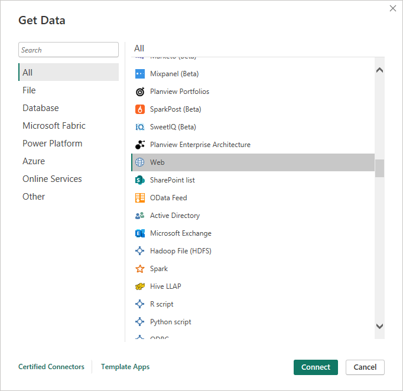

---
lab:
  title: Esplorare i principi fondamentali della visualizzazione dei dati con Power BI
  module: Explore fundamentals of data visualization
---

# <a name="explore-fundamentals-of-data-visualization-with-power-bi"></a>Esplorare i principi fondamentali della visualizzazione dei dati con Power BI

In questo esercizio si userà Microsoft Power BI Desktop per creare un modello di dati e un report contenente le visualizzazioni interattive dei dati.

Il completamento di questo lab richiederà circa **20** minuti.

## <a name="before-you-start"></a>Prima di iniziare

Sarà necessaria una [sottoscrizione di Azure](https://azure.microsoft.com/free) con accesso di livello amministrativo.

### <a name="install-power-bi-desktop"></a>Installare Power BI Desktop

Se Microsoft Power BI Desktop non è già installato nel computer Windows, è possibile scaricarlo e installarlo gratuitamente.

1. Scaricare il programma di installazione di Power BI Desktop da [https://aka.ms/power-bi-desktop](https://aka.ms/power-bi-desktop?azure-portal=true).
1. When the file has downloaded, open it, and use the setup wizard to install Power BI Desktop on your computer. This insatllation may take a few minutes.

## <a name="import-data"></a>Importa dati

1. Open Power BI Desktop. The application interface should look similar to this:

    

    A questo punto, è possibile importare i dati per il report.

1. Nella schermata iniziale di Power BI Desktop selezionare **Recupera dati** e quindi nell'elenco delle origini dati selezionare **Web** e quindi **Connetti**.

    

1. Nella finestra di dialogo **Da Web** immettere l'URL seguente e quindi selezionare **OK**:

    ```
    https://github.com/MicrosoftLearning/DP-900T00A-Azure-Data-Fundamentals/raw/master/power-bi/customers.csv
    ```

1. Nella finestra di dialogo Accedere a contenuto Web selezionare **Connetti**.

1. Verify that the URL opens a dataset containing customer data, as shown below. Then select <bpt id="p1">**</bpt>Load<ept id="p1">**</ept> to load the data into the data model for your report.

    

1. Nella finestra principale di Power BI Desktop nel menu Dati selezionare **Recupera dati** e quindi selezionare **Web**:

    

1. Nella finestra di dialogo **Da Web** immettere l'URL seguente e quindi selezionare **OK**:

    ```
    https://github.com/MicrosoftLearning/DP-900T00A-Azure-Data-Fundamentals/raw/master/power-bi/products.csv
    ```

1. Nella finestra di dialogo selezionare **Carica** per caricare i dati dei prodotti in questo file nel modello di dati.

1. Ripetere i tre passaggi precedenti per importare un terzo set di dati contenente i dati dell'ordine dall'URL seguente:

    ```
    https://github.com/MicrosoftLearning/DP-900T00A-Azure-Data-Fundamentals/raw/master/power-bi/orders.csv
    ```

## <a name="explore-a-data-model"></a>Esplorare un modello di dati

Le tre tabelle di dati importate sono state caricate in un modello di dati, che verrà ora esaminato e affinato.

1. In Power BI Desktop, on the left-side edge, select the <bpt id="p1">**</bpt>Model<ept id="p1">**</ept> tab, and then arrange the tables in the model so you can see them. You can hide the panes on the right side by using the <bpt id="p1">**</bpt><ph id="ph1">&gt;&gt;</ph><ept id="p1">**</ept> icons:

    

1. Nella tabella **ordini** selezionare il campo **Ricavi** e quindi nel riquadro **Proprietà** impostare la relativa proprietà **Formato** su **Valuta**:

    

    Questo passaggio garantisce che i valori dei ricavi vengano visualizzati come valuta nelle visualizzazioni del report.

1. In the products table, right-click the <bpt id="p1">**</bpt>Category<ept id="p1">**</ept> field (or open its <bpt id="p2">**</bpt><ph id="ph1">&amp;vellip;</ph><ept id="p2">**</ept> menu) and select <bpt id="p3">**</bpt>Create hierarchy<ept id="p3">**</ept>. This step creates a hierarchy named <bpt id="p1">**</bpt>Category Hierarchy<ept id="p1">**</ept>. You may need to expand or scroll in the <bpt id="p1">**</bpt>products<ept id="p1">**</ept> table to see this - you can also see it in the <bpt id="p2">**</bpt>Fields<ept id="p2">**</ept> pane:

    

1. In the products table, right-click the <bpt id="p1">**</bpt>ProductName<ept id="p1">**</ept> field (or open its <bpt id="p2">**</bpt><ph id="ph1">&amp;vellip;</ph><ept id="p2">**</ept> menu) and select <bpt id="p3">**</bpt>Add to hierarchy<ept id="p3">**</ept><ph id="ph2"> &gt; </ph><bpt id="p4">**</bpt>Category Hierarchy<ept id="p4">**</ept>. This adds the <bpt id="p1">**</bpt>ProductName<ept id="p1">**</ept> field to the hierarchy you created previously.
1. In the <bpt id="p1">**</bpt>Fields<ept id="p1">**</ept> pane, right-click <bpt id="p2">**</bpt>Category Hierarchy<ept id="p2">**</ept> (or open its <bpt id="p3">**</bpt>...<ept id="p3">**</ept> menu) and select <bpt id="p4">**</bpt>Rename<ept id="p4">**</ept>. Then rename the hierarchy to <bpt id="p1">**</bpt>Categorized Product<ept id="p1">**</ept>.

    

1. Nel bordo sinistro selezionare la scheda **Dati** e quindi nel riquadro **Campi** selezionare la tabella **clienti**.
1. Selezionare l'intestazione di colonna **Città** e quindi impostare la proprietà **Categoria di dati** su **Città**:

    

    Questo passaggio garantirà che i valori di questa colonna vengano interpretati come nomi di città, utili se si intende includere visualizzazioni di mappa.

## <a name="create-a-report"></a>Creare un report

Now you're almost ready to create a report. First you need to check some settings to ensure all visualizations are enabled.

1. On the <bpt id="p1">**</bpt>File<ept id="p1">**</ept> menu, select <bpt id="p2">**</bpt>Options and Settings<ept id="p2">**</ept>. Then select <bpt id="p1">**</bpt>Options<ept id="p1">**</ept>, and in the <bpt id="p2">**</bpt>Security<ept id="p2">**</ept> section, ensure that <bpt id="p3">**</bpt>Use Map and Filled Map visuals<ept id="p3">**</ept> is enabled and select <bpt id="p4">**</bpt>OK<ept id="p4">**</ept>.

    

    Questa impostazione garantisce che sia possibile includere visualizzazioni mappa nei report.

1. Nel bordo sinistro selezionare la scheda **Report** e visualizzare l'interfaccia di progettazione del report.

    

1. In the ribbon, above the report design surface, select <bpt id="p1">**</bpt>Text Box<ept id="p1">**</ept> and add a text box containing the text <bpt id="p2">**</bpt>Sales Report<ept id="p2">**</ept> to the report. Format the text to make it bold with a font size of 32.

    

1. Quando il file è stato scaricato, aprirlo e usare la procedura guidata di installazione per installare Power BI Desktop nel computer.

    

1. Questa installazione può richiedere alcuni minuti.

    The revenue is formatted as currency, as you specified in the model. However, you didn't specify the number of decimal places, so the values include fractional amounts. It won't matter for the visualizations you're going to create, but you could go back to the <bpt id="p1">**</bpt>Model<ept id="p1">**</ept> or <bpt id="p2">**</bpt>Data<ept id="p2">**</ept> tab and change the decimal places if you wish.

    

1. With the table still selected, in the <bpt id="p1">**</bpt>Visualizations<ept id="p1">**</ept> pane, select the <bpt id="p2">**</bpt>Stacked column chart<ept id="p2">**</ept> visualization. The table is changed to a column chart showing revenue by category.

    

1. Aprire Power BI Desktop.

    

1. L'interfaccia dell'applicazione ha un aspetto simile al seguente:
1. Select a blank area of the report, and then in the <bpt id="p1">**</bpt>Fields<ept id="p1">**</ept> pane, select the <bpt id="p2">**</bpt>Quantity<ept id="p2">**</ept> field in the <bpt id="p3">**</bpt>orders<ept id="p3">**</ept> table and the <bpt id="p4">**</bpt>Category<ept id="p4">**</ept> field in the <bpt id="p5">**</bpt>products<ept id="p5">**</ept> table. This step results in another column chart showing sales quantity by product category.
1. Con il nuovo grafico a colonne selezionato, nel riquadro **Visualizzazioni** selezionare **Grafico a torta** e quindi ridimensionare il grafico e posizionarlo accanto al grafico ricavi per colonna categoria.

    

1. Select a blank area of the report, and then in the <bpt id="p1">**</bpt>Fields<ept id="p1">**</ept> pane, select the <bpt id="p2">**</bpt>City<ept id="p2">**</ept> field in the <bpt id="p3">**</bpt>customers<ept id="p3">**</ept> table and then select the <bpt id="p4">**</bpt>Revenue<ept id="p4">**</ept> field in the <bpt id="p5">**</bpt>orders<ept id="p5">**</ept> table. This results in a map showing sales revenue by city. Rearrange and resize the visualizations as needed:

    

1. In the map, note that you can drag, double-click, use a mouse-wheel, or pinch and drag on a touch screen to interact. Then select a specific city, and note that the other visualizations in the report are modified to highlight the data for the selected city.

    

1. On the <bpt id="p1">**</bpt>File<ept id="p1">**</ept> menu, select <bpt id="p2">**</bpt>Save<ept id="p2">**</ept>. Then save the file with an appropriate .pbix file name. You can open the file and explore data modeling and visualization further at your leisure.

Se è disponibile una sottoscrizione del [servizio Power BI](https://www.powerbi.com/?azure-portal=true), è possibile accedere all'account e pubblicare il report in un'area di lavoro di Power BI. 
